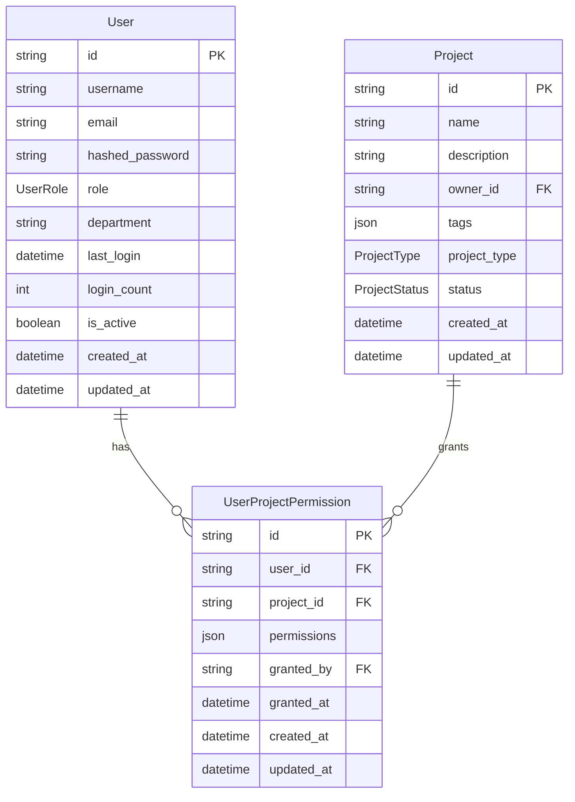

# COT Studio 平台增强功能设计文档

## 概述

本设计文档详细描述了COT Studio平台的全面增强方案，包括多租户账号管理系统、知识图谱模块修复、数据导出功能完善、响应式布局优化、仪表板功能改进、UI组件库升级以及前端错误修复。设计基于现有的FastAPI + React技术栈，采用渐进式升级策略，确保系统稳定性和用户体验的持续改进。

## 架构

### 当前技术栈
- **后端**: FastAPI + SQLAlchemy + PostgreSQL/SQLite + Neo4j + Redis + Celery
- **前端**: React 18 + TypeScript + Ant Design + Vite + Zustand
- **数据库**: 关系型数据库(用户/项目数据) + Neo4j(知识图谱) + Redis(缓存/队列)

### 增强后架构
- **后端**: 保持现有架构，增加权限管理中间件和资源监控服务
- **前端**: 升级到HeroUI组件库，增强响应式布局系统
- **权限系统**: 基于RBAC的多租户权限管理
- **监控系统**: 实时资源监控和用户活动追踪

## 组件和接口

### 1. 多租户账号管理系统

#### 数据模型增强

```python
# 用户角色枚举
class UserRole(PyEnum):
    SUPER_ADMIN = "super_admin"      # 超级管理员
    ADMIN = "admin"                  # 管理员
    USER = "user"                    # 普通用户
    VIEWER = "viewer"                # 只读用户

# 项目权限枚举
class ProjectPermission(PyEnum):
    VIEW = "view"                    # 查看权限
    CREATE = "create"                # 创建权限
    EDIT = "edit"                    # 编辑权限
    DELETE = "delete"                # 删除权限
    ADMIN = "admin"                  # 管理权限

# 用户项目权限关联表
class UserProjectPermission(BaseModel):
    __tablename__ = "user_project_permissions"
    
    user_id = Column(String(36), ForeignKey("users.id"), nullable=False)
    project_id = Column(String(36), ForeignKey("projects.id"), nullable=False)
    permissions = Column(JSON, default=list, nullable=False)  # 权限列表
    granted_by = Column(String(36), ForeignKey("users.id"))   # 授权人
    granted_at = Column(DateTime, default=datetime.utcnow)
    
    # 关系
    user = relationship("User", foreign_keys=[user_id])
    project = relationship("Project")
    granter = relationship("User", foreign_keys=[granted_by])

# 用户模型增强
class User(BaseModel):
    # ... 现有字段 ...
    role = Column(Enum(UserRole), default=UserRole.USER, nullable=False)
    department = Column(String(100))  # 部门
    last_login = Column(DateTime)     # 最后登录时间
    login_count = Column(Integer, default=0)  # 登录次数
    
    # 关系
    project_permissions = relationship("UserProjectPermission", 
                                     foreign_keys="UserProjectPermission.user_id")
```

#### API接口设计

```python
# 用户管理API
@router.post("/users", response_model=UserResponse)
async def create_user(user_data: UserCreateRequest, current_user: User = Depends(get_current_admin))

@router.put("/users/{user_id}", response_model=UserResponse)
async def update_user(user_id: str, user_data: UserUpdateRequest, current_user: User = Depends(get_current_admin))

@router.delete("/users/{user_id}")
async def delete_user(user_id: str, current_user: User = Depends(get_current_admin))

@router.get("/users", response_model=List[UserResponse])
async def list_users(skip: int = 0, limit: int = 100, current_user: User = Depends(get_current_admin))

# 权限管理API
@router.post("/users/{user_id}/permissions")
async def grant_project_permission(user_id: str, permission_data: PermissionGrantRequest, 
                                 current_user: User = Depends(get_current_admin))

@router.delete("/users/{user_id}/permissions/{project_id}")
async def revoke_project_permission(user_id: str, project_id: str, 
                                  current_user: User = Depends(get_current_admin))
```

#### 权限中间件

```python
class PermissionChecker:
    @staticmethod
    async def check_project_permission(user: User, project_id: str, 
                                     required_permission: ProjectPermission) -> bool:
        # 超级管理员拥有所有权限
        if user.role == UserRole.SUPER_ADMIN:
            return True
            
        # 项目所有者拥有所有权限
        project = await get_project(project_id)
        if project.owner_id == user.id:
            return True
            
        # 检查用户项目权限
        permission = await get_user_project_permission(user.id, project_id)
        return permission and required_permission.value in permission.permissions
```

### 2. 知识图谱模块修复

#### 前端路由增强

```typescript
// 知识图谱路由配置
const knowledgeGraphRoutes = [
  {
    path: '/knowledge-graph',
    element: <KnowledgeGraphList />,  // 新增：图谱列表页面
  },
  {
    path: '/knowledge-graph/:graphId',
    element: <KnowledgeGraphViewer />,  // 增强：支持直接访问
  },
  {
    path: '/projects/:projectId/knowledge-graph',
    element: <KnowledgeGraphViewer />,  // 保持：从项目访问
  }
];
```

#### 知识图谱列表组件

```typescript
interface KnowledgeGraphListProps {
  // 组件属性定义
}

const KnowledgeGraphList: React.FC<KnowledgeGraphListProps> = () => {
  const [graphs, setGraphs] = useState<KnowledgeGraph[]>([]);
  const [loading, setLoading] = useState(true);
  
  // 获取用户可访问的所有知识图谱
  const fetchAccessibleGraphs = async () => {
    const response = await api.get('/api/v1/knowledge-graphs/accessible');
    setGraphs(response.data);
  };
  
  return (
    <div className="knowledge-graph-list">
      {/* 图谱列表界面 */}
    </div>
  );
};
```

#### 后端API增强

```python
@router.get("/knowledge-graphs/accessible", response_model=List[KnowledgeGraphResponse])
async def get_accessible_knowledge_graphs(current_user: User = Depends(get_current_user)):
    """获取用户可访问的所有知识图谱"""
    # 根据用户权限返回可访问的知识图谱列表
    pass

@router.get("/knowledge-graphs/{graph_id}", response_model=KnowledgeGraphResponse)
async def get_knowledge_graph(graph_id: str, current_user: User = Depends(get_current_user)):
    """获取特定知识图谱详情"""
    # 检查用户权限并返回图谱数据
    pass
```

### 3. 数据导出功能完善

基于现有的导出功能实现，需要完善前端界面：

#### 前端导出页面重构

```typescript
interface ExportPageProps {
  // 导出页面属性
}

const ExportPage: React.FC<ExportPageProps> = () => {
  const [projects, setProjects] = useState<Project[]>([]);
  const [selectedProject, setSelectedProject] = useState<string>('');
  const [exportFormat, setExportFormat] = useState<ExportFormat>(ExportFormat.JSON);
  const [exportOptions, setExportOptions] = useState({
    includeMetadata: true,
    includeFiles: true,
    includeAnnotations: true
  });
  
  const handleExport = async () => {
    const exportRequest: ExportRequest = {
      projectId: selectedProject,
      format: exportFormat,
      ...exportOptions
    };
    
    const response = await api.post('/api/v1/export/projects', exportRequest);
    // 处理导出任务
  };
  
  return (
    <div className="export-page">
      {/* 导出界面实现 */}
    </div>
  );
};
```

### 4. 响应式布局优化

#### 布局系统设计

```typescript
// 响应式布局配置
const LAYOUT_CONFIG = {
  breakpoints: {
    xs: 0,
    sm: 576,
    md: 768,
    lg: 992,
    xl: 1200,
    xxl: 1600
  },
  
  // 固定区域尺寸（不随分辨率变化）
  fixedAreas: {
    header: { height: 64 },
    sidebar: { width: 240 },
    footer: { height: 48 }
  },
  
  // 动态区域（随分辨率调整）
  dynamicAreas: {
    workArea: { minWidth: 800, flex: 1 },
    projectPanel: { minWidth: 300, maxWidth: 400 },
    visualArea: { minWidth: 600, flex: 2 }
  }
};

// 响应式布局Hook
const useResponsiveLayout = () => {
  const [screenSize, setScreenSize] = useState(getScreenSize());
  const [layoutConfig, setLayoutConfig] = useState(calculateLayout(screenSize));
  
  useEffect(() => {
    const handleResize = () => {
      const newSize = getScreenSize();
      setScreenSize(newSize);
      setLayoutConfig(calculateLayout(newSize));
    };
    
    window.addEventListener('resize', handleResize);
    return () => window.removeEventListener('resize', handleResize);
  }, []);
  
  return layoutConfig;
};
```

#### 主布局组件重构

```typescript
const MainLayout: React.FC<{ children: React.ReactNode }> = ({ children }) => {
  const layoutConfig = useResponsiveLayout();
  
  return (
    <div className="main-layout" style={layoutConfig.containerStyle}>
      <Header style={layoutConfig.headerStyle} />
      <div className="layout-body" style={layoutConfig.bodyStyle}>
        <Sidebar style={layoutConfig.sidebarStyle} />
        <div className="work-area" style={layoutConfig.workAreaStyle}>
          {children}
        </div>
      </div>
      <Footer style={layoutConfig.footerStyle} />
    </div>
  );
};
```

### 5. 仪表板功能改进

#### 系统资源监控

```python
# 系统监控服务
class SystemMonitorService:
    @staticmethod
    async def get_system_resources() -> SystemResourcesResponse:
        """获取系统资源使用情况"""
        import psutil
        
        # CPU使用率
        cpu_percent = psutil.cpu_percent(interval=1)
        
        # 内存使用情况
        memory = psutil.virtual_memory()
        memory_used = memory.used
        memory_total = memory.total
        memory_percent = memory.percent
        
        # 磁盘使用情况
        disk = psutil.disk_usage('/')
        disk_used = disk.used
        disk_total = disk.total
        disk_percent = (disk_used / disk_total) * 100
        
        # 数据库连接数
        db_connections = await get_active_db_connections()
        
        # 任务队列状态
        queue_status = await get_celery_queue_status()
        
        return SystemResourcesResponse(
            cpu_percent=cpu_percent,
            memory_used=memory_used,
            memory_total=memory_total,
            memory_percent=memory_percent,
            disk_used=disk_used,
            disk_total=disk_total,
            disk_percent=disk_percent,
            db_connections=db_connections,
            queue_status=queue_status
        )
```

#### 用户贡献可视化

```typescript
// 用户贡献可视化组件
const UserContributionGraph: React.FC = () => {
  const [contributionData, setContributionData] = useState<ContributionData>({
    nodes: [],
    edges: []
  });
  
  const fetchContributionData = async () => {
    const response = await api.get('/api/v1/analytics/user-contributions');
    
    // 转换数据为图形格式
    const nodes = response.data.users.map(user => ({
      id: user.id,
      label: user.username,
      size: Math.max(10, user.datasetCount * 2), // 节点大小与数据集数量相关
      color: '#1677ff',
      type: 'user'
    }));
    
    const datasetNodes = response.data.datasets.map(dataset => ({
      id: dataset.id,
      label: dataset.name,
      size: Math.max(8, dataset.itemCount * 0.5), // 节点大小与数据条目相关
      color: '#52c41a',
      type: 'dataset'
    }));
    
    const edges = response.data.relationships.map(rel => ({
      source: rel.userId,
      target: rel.datasetId,
      color: '#d9d9d9'
    }));
    
    setContributionData({
      nodes: [...nodes, ...datasetNodes],
      edges
    });
  };
  
  return (
    <div className="user-contribution-graph">
      <KnowledgeGraphViewer
        data={contributionData}
        height={300}
        showControls={false}
        layout="cose"
      />
    </div>
  );
};
```

#### 仪表板布局重构

```typescript
const Dashboard: React.FC = () => {
  return (
    <div className="dashboard">
      {/* 第一排：基础统计卡片 */}
      <Row gutter={[24, 24]}>
        <Col span={8}><ProjectStatsCard /></Col>
        <Col span={8}><DataStatsCard /></Col>
        <Col span={8}><GraphStatsCard /></Col>
      </Row>
      
      {/* 第二排：系统状态和用户贡献 */}
      <Row gutter={[24, 24]} style={{ marginTop: '24px' }}>
        <Col span={12}>
          <Card title="系统状态">
            <SystemResourceMonitor />
          </Card>
        </Col>
        <Col span={12}>
          <Card title="用户贡献">
            <UserContributionGraph />
          </Card>
        </Col>
      </Row>
      
      {/* 第三排：最近活动 */}
      <Row gutter={[24, 24]} style={{ marginTop: '24px' }}>
        <Col span={24}>
          <Card title="最近活动">
            <RecentActivityList />
          </Card>
        </Col>
      </Row>
    </div>
  );
};
```

### 6. HeroUI组件库集成

#### 依赖管理

```json
{
  "dependencies": {
    "@heroui/react": "^2.0.0",
    "@heroui/theme": "^2.0.0",
    "framer-motion": "^10.0.0"
  }
}
```

#### 主题配置

```typescript
// theme.config.ts
import { createTheme } from '@heroui/react';

export const heroUITheme = createTheme({
  type: 'light',
  theme: {
    colors: {
      primary: '#1677ff',
      secondary: '#52c41a',
      success: '#52c41a',
      warning: '#faad14',
      error: '#ff4d4f',
      background: '#ffffff',
      foreground: '#000000'
    },
    space: {
      xs: '0.5rem',
      sm: '0.75rem',
      md: '1rem',
      lg: '1.5rem',
      xl: '2rem'
    },
    borderRadius: {
      xs: '0.25rem',
      sm: '0.375rem',
      md: '0.5rem',
      lg: '0.75rem',
      xl: '1rem'
    }
  }
});
```

#### 组件迁移策略

```typescript
// 组件映射表
const COMPONENT_MIGRATION_MAP = {
  // Ant Design -> HeroUI
  'Button': '@heroui/react/Button',
  'Card': '@heroui/react/Card',
  'Table': '@heroui/react/Table',
  'Form': '@heroui/react/Form',
  'Input': '@heroui/react/Input',
  'Select': '@heroui/react/Select',
  'Modal': '@heroui/react/Modal',
  'Drawer': '@heroui/react/Drawer',
  'Tabs': '@heroui/react/Tabs',
  'Menu': '@heroui/react/Menu'
};

// 渐进式迁移工具
const migrateComponent = (componentName: string, props: any) => {
  const HeroUIComponent = COMPONENT_MIGRATION_MAP[componentName];
  if (HeroUIComponent) {
    return React.createElement(HeroUIComponent, adaptProps(props));
  }
  // 回退到原组件
  return null;
};
```

## 数据模型

### 用户权限数据模型



### 系统监控数据模型

```typescript
interface SystemResourcesResponse {
  cpu_percent: number;
  memory_used: number;
  memory_total: number;
  memory_percent: number;
  disk_used: number;
  disk_total: number;
  disk_percent: number;
  db_connections: number;
  queue_status: {
    pending: number;
    active: number;
    failed: number;
  };
  timestamp: string;
}

interface UserContributionData {
  users: Array<{
    id: string;
    username: string;
    datasetCount: number;
    totalItems: number;
  }>;
  datasets: Array<{
    id: string;
    name: string;
    itemCount: number;
    ownerId: string;
  }>;
  relationships: Array<{
    userId: string;
    datasetId: string;
  }>;
}
```

## 错误处理

### 权限错误处理

```python
class PermissionError(HTTPException):
    def __init__(self, detail: str = "权限不足"):
        super().__init__(status_code=403, detail=detail)

class ResourceNotFoundError(HTTPException):
    def __init__(self, resource: str, resource_id: str):
        super().__init__(
            status_code=404, 
            detail=f"{resource} {resource_id} 不存在"
        )

# 全局错误处理器
@app.exception_handler(PermissionError)
async def permission_error_handler(request: Request, exc: PermissionError):
    return JSONResponse(
        status_code=exc.status_code,
        content={"detail": exc.detail, "type": "permission_error"}
    )
```

### 前端错误处理

```typescript
// 全局错误处理
const GlobalErrorHandler: React.FC = () => {
  const [error, setError] = useState<Error | null>(null);
  
  useEffect(() => {
    const handleError = (event: ErrorEvent) => {
      console.error('Global error:', event.error);
      setError(event.error);
    };
    
    const handleUnhandledRejection = (event: PromiseRejectionEvent) => {
      console.error('Unhandled promise rejection:', event.reason);
      setError(new Error(event.reason));
    };
    
    window.addEventListener('error', handleError);
    window.addEventListener('unhandledrejection', handleUnhandledRejection);
    
    return () => {
      window.removeEventListener('error', handleError);
      window.removeEventListener('unhandledrejection', handleUnhandledRejection);
    };
  }, []);
  
  if (error) {
    return <ErrorBoundary error={error} onReset={() => setError(null)} />;
  }
  
  return null;
};
```

## 测试策略

### 后端测试

```python
# 权限系统测试
class TestPermissionSystem:
    async def test_super_admin_permissions(self):
        """测试超级管理员权限"""
        # 创建超级管理员用户
        # 验证所有权限
        pass
    
    async def test_project_owner_permissions(self):
        """测试项目所有者权限"""
        # 创建项目所有者
        # 验证项目权限
        pass
    
    async def test_user_project_permissions(self):
        """测试用户项目权限"""
        # 创建普通用户
        # 分配项目权限
        # 验证权限检查
        pass

# 系统监控测试
class TestSystemMonitoring:
    async def test_resource_monitoring(self):
        """测试资源监控"""
        # 获取系统资源信息
        # 验证数据格式和范围
        pass
```

### 前端测试

```typescript
// 组件测试
describe('UserManagement', () => {
  test('should render user list', async () => {
    render(<UserManagement />);
    expect(screen.getByText('用户管理')).toBeInTheDocument();
  });
  
  test('should create new user', async () => {
    const { user } = renderWithProviders(<UserManagement />);
    
    await user.click(screen.getByText('创建用户'));
    await user.type(screen.getByLabelText('用户名'), 'testuser');
    await user.click(screen.getByText('确认'));
    
    expect(screen.getByText('用户创建成功')).toBeInTheDocument();
  });
});

// 响应式布局测试
describe('ResponsiveLayout', () => {
  test('should adapt to different screen sizes', () => {
    const { rerender } = render(<MainLayout><div>Content</div></MainLayout>);
    
    // 测试不同屏幕尺寸下的布局
    Object.defineProperty(window, 'innerWidth', { value: 1920 });
    window.dispatchEvent(new Event('resize'));
    
    // 验证布局调整
  });
});
```

## 性能优化

### 前端性能优化

```typescript
// 组件懒加载
const UserManagement = lazy(() => import('./pages/UserManagement'));
const KnowledgeGraphList = lazy(() => import('./pages/KnowledgeGraphList'));
const ExportPage = lazy(() => import('./pages/ExportPage'));

// 数据缓存策略
const useUserList = () => {
  return useQuery({
    queryKey: ['users'],
    queryFn: fetchUsers,
    staleTime: 5 * 60 * 1000, // 5分钟缓存
    cacheTime: 10 * 60 * 1000 // 10分钟保留
  });
};

// 虚拟滚动优化
const VirtualizedTable: React.FC<{ data: any[] }> = ({ data }) => {
  return (
    <FixedSizeList
      height={600}
      itemCount={data.length}
      itemSize={50}
      itemData={data}
    >
      {TableRow}
    </FixedSizeList>
  );
};
```

### 后端性能优化

```python
# 数据库查询优化
class UserService:
    @staticmethod
    async def get_users_with_permissions(skip: int = 0, limit: int = 100):
        """优化的用户查询，包含权限信息"""
        query = (
            select(User)
            .options(
                selectinload(User.project_permissions)
                .selectinload(UserProjectPermission.project)
            )
            .offset(skip)
            .limit(limit)
        )
        result = await db.execute(query)
        return result.scalars().all()

# 缓存策略
@lru_cache(maxsize=128)
async def get_user_permissions(user_id: str, project_id: str):
    """缓存用户权限查询"""
    # 权限查询逻辑
    pass

# 异步任务优化
@celery_app.task(bind=True, max_retries=3)
def export_project_task(self, project_id: str, export_options: dict):
    """优化的导出任务"""
    try:
        # 分批处理大量数据
        # 进度报告
        # 错误恢复
        pass
    except Exception as exc:
        self.retry(countdown=60, exc=exc)
```

这个设计文档涵盖了所有需求的详细技术实现方案，包括数据模型、API设计、前端组件架构、错误处理、测试策略和性能优化。设计采用渐进式升级策略，确保系统稳定性的同时实现功能增强。