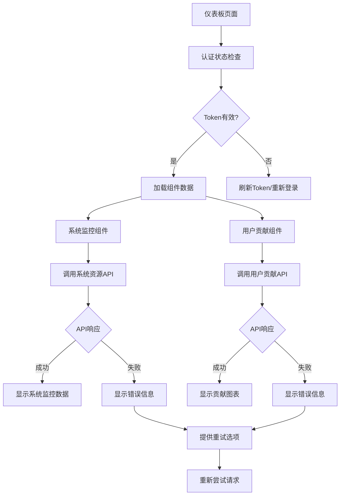

# 前端仪表板错误修复设计文档

## 概述

本设计文档详细描述了修复COT Studio前端主页仪表板错误的技术方案。主要问题是前端组件在调用后端API时遇到401未授权错误，导致系统监控和用户贡献数据无法正常显示。设计方案包括认证机制修复、API调用优化、错误处理改进和用户体验提升。

## 架构

### 当前问题分析

根据控制台错误信息和代码分析，主要问题包括：

1. **认证Token问题**: 前端可能没有正确获取或发送认证token
2. **API调用错误**: 请求头格式或token格式不正确
3. **错误处理不完善**: 组件没有优雅处理认证失败的情况
4. **数据刷新机制**: 自动刷新可能导致重复的失败请求

### 修复架构设计



## 组件和接口

### 1. 认证机制修复

#### Token管理服务增强

```typescript
// 认证服务增强
class AuthService {
  private static instance: AuthService;
  private token: string | null = null;
  private refreshToken: string | null = null;
  private tokenExpiry: Date | null = null;

  static getInstance(): AuthService {
    if (!AuthService.instance) {
      AuthService.instance = new AuthService();
    }
    return AuthService.instance;
  }

  // 获取有效token
  async getValidToken(): Promise<string | null> {
    // 检查token是否存在
    if (!this.token) {
      this.token = localStorage.getItem('token');
    }

    // 检查token是否过期
    if (this.token && this.isTokenExpired()) {
      try {
        await this.refreshAccessToken();
      } catch (error) {
        console.error('Token refresh failed:', error);
        this.clearTokens();
        return null;
      }
    }

    return this.token;
  }

  // 检查token是否过期
  private isTokenExpired(): boolean {
    if (!this.tokenExpiry) {
      // 尝试解析token获取过期时间
      try {
        const payload = JSON.parse(atob(this.token!.split('.')[1]));
        this.tokenExpiry = new Date(payload.exp * 1000);
      } catch {
        return true; // 无法解析则认为过期
      }
    }
    
    return this.tokenExpiry <= new Date();
  }

  // 刷新访问token
  private async refreshAccessToken(): Promise<void> {
    if (!this.refreshToken) {
      this.refreshToken = localStorage.getItem('refreshToken');
    }

    if (!this.refreshToken) {
      throw new Error('No refresh token available');
    }

    const response = await fetch('/api/v1/auth/refresh', {
      method: 'POST',
      headers: {
        'Content-Type': 'application/json',
      },
      body: JSON.stringify({
        refresh_token: this.refreshToken
      })
    });

    if (!response.ok) {
      throw new Error('Token refresh failed');
    }

    const data = await response.json();
    this.token = data.access_token;
    this.refreshToken = data.refresh_token;
    
    localStorage.setItem('token', this.token);
    localStorage.setItem('refreshToken', this.refreshToken);
    
    // 重新计算过期时间
    this.tokenExpiry = null;
  }

  // 清理tokens
  clearTokens(): void {
    this.token = null;
    this.refreshToken = null;
    this.tokenExpiry = null;
    localStorage.removeItem('token');
    localStorage.removeItem('refreshToken');
  }
}
```

#### API请求拦截器

```typescript
// API请求工具类
class ApiClient {
  private authService = AuthService.getInstance();

  async request<T>(url: string, options: RequestInit = {}): Promise<T> {
    // 获取有效token
    const token = await this.authService.getValidToken();
    
    if (!token) {
      // 重定向到登录页面
      window.location.href = '/login';
      throw new Error('Authentication required');
    }

    // 设置请求头
    const headers = {
      'Content-Type': 'application/json',
      'Authorization': `Bearer ${token}`,
      ...options.headers,
    };

    try {
      const response = await fetch(url, {
        ...options,
        headers,
      });

      // 处理认证错误
      if (response.status === 401) {
        console.warn('Authentication failed, clearing tokens');
        this.authService.clearTokens();
        window.location.href = '/login';
        throw new Error('Authentication failed');
      }

      // 处理其他HTTP错误
      if (!response.ok) {
        const errorData = await response.json().catch(() => ({}));
        throw new ApiError(response.status, errorData.detail || 'Request failed');
      }

      return await response.json();
    } catch (error) {
      if (error instanceof ApiError) {
        throw error;
      }
      
      // 网络错误或其他错误
      throw new ApiError(0, 'Network error or server unavailable');
    }
  }

  // 便捷方法
  get<T>(url: string): Promise<T> {
    return this.request<T>(url, { method: 'GET' });
  }

  post<T>(url: string, data?: any): Promise<T> {
    return this.request<T>(url, {
      method: 'POST',
      body: data ? JSON.stringify(data) : undefined,
    });
  }
}

// 自定义错误类
class ApiError extends Error {
  constructor(public status: number, message: string) {
    super(message);
    this.name = 'ApiError';
  }
}

// 导出单例实例
export const apiClient = new ApiClient();
```

### 2. 系统监控组件修复

#### 重构SystemResourceMonitor组件

```typescript
import React, { useState, useEffect, useCallback, useRef } from 'react';
import { Card, Progress, Space, Typography, Alert, Spin, Button } from 'antd';
import { ReloadOutlined, ExclamationCircleOutlined } from '@ant-design/icons';
import { apiClient, ApiError } from '../../utils/apiClient';
import { useResponsiveBreakpoint } from '../../hooks/useResponsiveBreakpoint';

const { Text } = Typography;

interface SystemResources {
  timestamp: string;
  cpu: {
    percent: number;
    count: number;
    count_logical: number;
  };
  memory: {
    used: number;
    total: number;
    percent: number;
    available: number;
  };
  disk: {
    used: number;
    total: number;
    percent: number;
    free: number;
  };
  database: {
    connections: number;
  };
  queue: {
    pending: number;
    active: number;
    failed: number;
    completed: number;
  };
}

interface SystemHealth {
  status: 'healthy' | 'moderate' | 'warning' | 'critical' | 'unknown';
  timestamp: string;
  summary: {
    cpu_percent: number;
    memory_percent: number;
    disk_percent: number;
    database_connections: number;
    queue_pending: number;
  };
}

const SystemResourceMonitor: React.FC = () => {
  const [resources, setResources] = useState<SystemResources | null>(null);
  const [health, setHealth] = useState<SystemHealth | null>(null);
  const [loading, setLoading] = useState(true);
  const [error, setError] = useState<string | null>(null);
  const [lastUpdate, setLastUpdate] = useState<Date | null>(null);
  const [retryCount, setRetryCount] = useState(0);
  
  const { isMobile } = useResponsiveBreakpoint();
  const intervalRef = useRef<NodeJS.Timeout | null>(null);
  const mountedRef = useRef(true);

  // 获取系统资源数据
  const fetchSystemResources = useCallback(async () => {
    try {
      const result = await apiClient.get<{
        success: boolean;
        data: SystemResources;
      }>('/api/v1/system/resources');
      
      if (mountedRef.current && result.success) {
        setResources(result.data);
        setLastUpdate(new Date());
        setError(null);
        setRetryCount(0);
      }
    } catch (err) {
      console.error('Error fetching system resources:', err);
      
      if (mountedRef.current) {
        if (err instanceof ApiError) {
          switch (err.status) {
            case 401:
              setError('认证失败，请重新登录');
              break;
            case 403:
              setError('权限不足，无法访问系统监控数据');
              break;
            case 500:
              setError('服务器内部错误，请稍后重试');
              break;
            case 0:
              setError('网络连接失败，请检查网络连接');
              break;
            default:
              setError(`请求失败: ${err.message}`);
          }
        } else {
          setError('未知错误，请重试');
        }
        
        setRetryCount(prev => prev + 1);
      }
    }
  }, []);

  // 获取系统健康状态
  const fetchSystemHealth = useCallback(async () => {
    try {
      const result = await apiClient.get<{
        success: boolean;
        data: SystemHealth;
      }>('/api/v1/system/health');
      
      if (mountedRef.current && result.success) {
        setHealth(result.data);
      }
    } catch (err) {
      console.error('Error fetching system health:', err);
      // 健康状态获取失败不影响主要功能
    }
  }, []);

  // 获取所有数据
  const fetchData = useCallback(async () => {
    if (!mountedRef.current) return;
    
    setLoading(true);
    await Promise.all([
      fetchSystemResources(),
      fetchSystemHealth()
    ]);
    
    if (mountedRef.current) {
      setLoading(false);
    }
  }, [fetchSystemResources, fetchSystemHealth]);

  // 手动重试
  const handleRetry = useCallback(() => {
    setError(null);
    setRetryCount(0);
    fetchData();
  }, [fetchData]);

  // 设置自动刷新
  const setupAutoRefresh = useCallback(() => {
    if (intervalRef.current) {
      clearInterval(intervalRef.current);
    }

    // 根据重试次数调整刷新间隔
    const baseInterval = 30000; // 30秒
    const interval = Math.min(baseInterval * Math.pow(2, retryCount), 300000); // 最大5分钟

    intervalRef.current = setInterval(() => {
      if (mountedRef.current && document.visibilityState === 'visible') {
        fetchData();
      }
    }, interval);
  }, [fetchData, retryCount]);

  // 组件挂载时获取数据
  useEffect(() => {
    mountedRef.current = true;
    fetchData();
    
    return () => {
      mountedRef.current = false;
      if (intervalRef.current) {
        clearInterval(intervalRef.current);
      }
    };
  }, [fetchData]);

  // 设置自动刷新
  useEffect(() => {
    if (!error && resources) {
      setupAutoRefresh();
    }
    
    return () => {
      if (intervalRef.current) {
        clearInterval(intervalRef.current);
      }
    };
  }, [setupAutoRefresh, error, resources]);

  // 页面可见性变化处理
  useEffect(() => {
    const handleVisibilityChange = () => {
      if (document.visibilityState === 'visible' && !error) {
        fetchData();
      }
    };

    document.addEventListener('visibilitychange', handleVisibilityChange);
    return () => {
      document.removeEventListener('visibilitychange', handleVisibilityChange);
    };
  }, [fetchData, error]);

  // 格式化字节数
  const formatBytes = (bytes: number): string => {
    const units = ['B', 'KB', 'MB', 'GB', 'TB'];
    let size = bytes;
    let unitIndex = 0;
    
    while (size >= 1024 && unitIndex < units.length - 1) {
      size /= 1024;
      unitIndex++;
    }
    
    return `${size.toFixed(2)} ${units[unitIndex]}`;
  };

  // 获取进度条颜色
  const getProgressColor = (percent: number): string => {
    if (percent >= 90) return '#ff4d4f';
    if (percent >= 70) return '#fa8c16';
    if (percent >= 50) return '#faad14';
    return '#52c41a';
  };

  // 获取健康状态颜色和文本
  const getHealthColor = (status: string): string => {
    switch (status) {
      case 'healthy': return '#52c41a';
      case 'moderate': return '#faad14';
      case 'warning': return '#fa8c16';
      case 'critical': return '#ff4d4f';
      default: return '#d9d9d9';
    }
  };

  const getHealthText = (status: string): string => {
    switch (status) {
      case 'healthy': return '健康';
      case 'moderate': return '一般';
      case 'warning': return '警告';
      case 'critical': return '严重';
      default: return '未知';
    }
  };

  // 加载状态
  if (loading && !resources) {
    return (
      <Card className="modern-card">
        <div style={{ textAlign: 'center', padding: '40px 0' }}>
          <Spin size="large" />
          <div style={{ marginTop: '16px' }}>
            <Text type="secondary">加载系统资源信息...</Text>
          </div>
        </div>
      </Card>
    );
  }

  // 错误状态
  if (error && !resources) {
    return (
      <Card className="modern-card">
        <Alert
          message="系统监控不可用"
          description={
            <div>
              <div style={{ marginBottom: '8px' }}>{error}</div>
              {retryCount > 0 && (
                <Text type="secondary" style={{ fontSize: '12px' }}>
                  已重试 {retryCount} 次
                </Text>
              )}
            </div>
          }
          type="error"
          showIcon
          icon={<ExclamationCircleOutlined />}
          action={
            <Button 
              size="small"
              type="primary"
              onClick={handleRetry}
              loading={loading}
            >
              重试
            </Button>
          }
        />
      </Card>
    );
  }

  return (
    <div>
      {/* 系统健康状态概览 */}
      {health && (
        <Card 
          className="modern-card" 
          style={{ marginBottom: '16px' }}
          size="small"
        >
          <div style={{ 
            display: 'flex', 
            justifyContent: 'space-between', 
            alignItems: 'center' 
          }}>
            <Space>
              <Text strong>系统状态</Text>
              <Text 
                style={{ 
                  color: getHealthColor(health.status),
                  fontWeight: 'bold'
                }}
              >
                {getHealthText(health.status)}
              </Text>
            </Space>
            <Button
              size="small"
              icon={<ReloadOutlined spin={loading} />}
              onClick={handleRetry}
              disabled={loading}
            >
              刷新
            </Button>
          </div>
        </Card>
      )}

      {/* 资源指标 */}
      {resources && (
        <Space direction="vertical" style={{ width: '100%' }} size="middle">
          {/* CPU使用率 */}
          <div>
            <div style={{ 
              display: 'flex', 
              justifyContent: 'space-between', 
              alignItems: 'center',
              marginBottom: '8px' 
            }}>
              <Text style={{ fontSize: isMobile ? '12px' : '14px' }}>
                CPU使用率
              </Text>
              <Text style={{ fontSize: isMobile ? '12px' : '14px' }}>
                {resources.cpu.percent.toFixed(1)}%
              </Text>
            </div>
            <Progress 
              percent={resources.cpu.percent} 
              strokeColor={getProgressColor(resources.cpu.percent)}
              size={isMobile ? 'small' : 'default'}
              showInfo={false}
            />
          </div>

          {/* 内存使用率 */}
          <div>
            <div style={{ 
              display: 'flex', 
              justifyContent: 'space-between', 
              alignItems: 'center',
              marginBottom: '8px' 
            }}>
              <Text style={{ fontSize: isMobile ? '12px' : '14px' }}>
                内存使用率
              </Text>
              <Text style={{ fontSize: isMobile ? '12px' : '14px' }}>
                {formatBytes(resources.memory.used)} / {formatBytes(resources.memory.total)}
              </Text>
            </div>
            <Progress 
              percent={resources.memory.percent} 
              strokeColor={getProgressColor(resources.memory.percent)}
              size={isMobile ? 'small' : 'default'}
              showInfo={false}
            />
          </div>

          {/* 磁盘使用率 */}
          <div>
            <div style={{ 
              display: 'flex', 
              justifyContent: 'space-between', 
              alignItems: 'center',
              marginBottom: '8px' 
            }}>
              <Text style={{ fontSize: isMobile ? '12px' : '14px' }}>
                磁盘使用率
              </Text>
              <Text style={{ fontSize: isMobile ? '12px' : '14px' }}>
                {formatBytes(resources.disk.used)} / {formatBytes(resources.disk.total)}
              </Text>
            </div>
            <Progress 
              percent={resources.disk.percent} 
              strokeColor={getProgressColor(resources.disk.percent)}
              size={isMobile ? 'small' : 'default'}
              showInfo={false}
            />
          </div>

          {/* 任务队列状态 */}
          <div>
            <div style={{ 
              display: 'flex', 
              justifyContent: 'space-between', 
              alignItems: 'center',
              marginBottom: '8px' 
            }}>
              <Text style={{ fontSize: isMobile ? '12px' : '14px' }}>
                任务队列
              </Text>
              <Text style={{ fontSize: isMobile ? '12px' : '14px' }}>
                {resources.queue.pending} 待处理
              </Text>
            </div>
            <Progress 
              percent={Math.min((resources.queue.pending / 10) * 100, 100)} 
              strokeColor="#faad14"
              size={isMobile ? 'small' : 'default'}
              showInfo={false}
            />
          </div>
        </Space>
      )}

      {/* 最后更新时间 */}
      {lastUpdate && (
        <div style={{ 
          textAlign: 'center', 
          marginTop: '12px',
          fontSize: isMobile ? '10px' : '11px',
          color: '#8c8c8c'
        }}>
          最后更新: {lastUpdate.toLocaleTimeString()}
        </div>
      )}

      {/* 错误提示（当有数据但获取新数据失败时） */}
      {error && resources && (
        <Alert
          message="数据更新失败"
          description={error}
          type="warning"
          showIcon
          style={{ marginTop: '12px' }}
          action={
            <Button size="small" onClick={handleRetry}>
              重试
            </Button>
          }
        />
      )}
    </div>
  );
};

export default SystemResourceMonitor;
```

### 3. 用户贡献组件修复

#### 重构UserContributionGraph组件

```typescript
import React, { useState, useEffect, useCallback, useRef } from 'react';
import { Card, Alert, Spin, Typography, Space, Tag, Button } from 'antd';
import { 
  UserOutlined, 
  ProjectOutlined, 
  TeamOutlined,
  FileTextOutlined,
  ExclamationCircleOutlined,
  ReloadOutlined
} from '@ant-design/icons';
import { KnowledgeGraphViewer } from '../knowledge-graph';
import { apiClient, ApiError } from '../../utils/apiClient';
import { useResponsiveBreakpoint } from '../../hooks/useResponsiveBreakpoint';

const { Text } = Typography;

interface ContributionUser {
  id: string;
  name: string;
  email: string;
  type: 'user';
  project_count: number;
  total_cot_items: number;
  size: number;
}

interface ContributionProject {
  id: string;
  name: string;
  type: 'project';
  file_count: number;
  cot_count: number;
  owner_id: string;
  size: number;
}

interface ContributionRelationship {
  source: string;
  target: string;
  type: 'owns';
}

interface ContributionData {
  users: ContributionUser[];
  datasets: ContributionProject[];
  relationships: ContributionRelationship[];
  summary: {
    total_users: number;
    total_projects: number;
    total_relationships: number;
    total_cot_items: number;
  };
}

interface GraphNode {
  id: string;
  label: string;
  size: number;
  color: string;
  type: string;
  data?: any;
}

interface GraphEdge {
  source: string;
  target: string;
  color: string;
  type: string;
}

interface GraphData {
  nodes: GraphNode[];
  edges: GraphEdge[];
}

const UserContributionGraph: React.FC = () => {
  const [contributionData, setContributionData] = useState<ContributionData | null>(null);
  const [graphData, setGraphData] = useState<GraphData>({ nodes: [], edges: [] });
  const [loading, setLoading] = useState(true);
  const [error, setError] = useState<string | null>(null);
  const [selectedNode, setSelectedNode] = useState<GraphNode | null>(null);
  const [retryCount, setRetryCount] = useState(0);
  
  const { isMobile } = useResponsiveBreakpoint();
  const mountedRef = useRef(true);

  // 获取用户贡献数据
  const fetchContributionData = useCallback(async () => {
    try {
      const result = await apiClient.get<{
        success: boolean;
        data: ContributionData;
      }>('/api/v1/analytics/user-contributions');
      
      if (mountedRef.current && result.success) {
        setContributionData(result.data);
        transformDataForVisualization(result.data);
        setError(null);
        setRetryCount(0);
      }
    } catch (err) {
      console.error('Error fetching contribution data:', err);
      
      if (mountedRef.current) {
        if (err instanceof ApiError) {
          switch (err.status) {
            case 401:
              setError('认证失败，请重新登录');
              break;
            case 403:
              setError('权限不足，无法访问用户贡献数据');
              break;
            case 500:
              setError('服务器内部错误，请稍后重试');
              break;
            case 0:
              setError('网络连接失败，请检查网络连接');
              break;
            default:
              setError(`请求失败: ${err.message}`);
          }
        } else {
          setError('未知错误，请重试');
        }
        
        setRetryCount(prev => prev + 1);
      }
    } finally {
      if (mountedRef.current) {
        setLoading(false);
      }
    }
  }, []);

  // 转换数据为可视化格式
  const transformDataForVisualization = useCallback((data: ContributionData) => {
    // 转换用户为节点
    const userNodes: GraphNode[] = data.users.map(user => ({
      id: user.id,
      label: user.name,
      size: user.size,
      color: '#1677ff',
      type: 'user',
      data: {
        email: user.email,
        project_count: user.project_count,
        total_cot_items: user.total_cot_items
      }
    }));

    // 转换项目为节点
    const projectNodes: GraphNode[] = data.datasets.map(project => ({
      id: project.id,
      label: project.name,
      size: project.size,
      color: '#52c41a',
      type: 'project',
      data: {
        file_count: project.file_count,
        cot_count: project.cot_count,
        owner_id: project.owner_id
      }
    }));

    // 转换关系为边
    const edges: GraphEdge[] = data.relationships.map(rel => ({
      source: rel.source,
      target: rel.target,
      color: '#d9d9d9',
      type: rel.type
    }));

    setGraphData({
      nodes: [...userNodes, ...projectNodes],
      edges
    });
  }, []);

  // 处理节点选择
  const handleNodeSelect = useCallback((node: any) => {
    const graphNode = graphData.nodes.find(n => n.id === node.id);
    setSelectedNode(graphNode || null);
  }, [graphData.nodes]);

  // 处理边选择
  const handleEdgeSelect = useCallback((edge: any) => {
    console.log('Edge selected:', edge);
  }, []);

  // 手动重试
  const handleRetry = useCallback(() => {
    setError(null);
    setRetryCount(0);
    setLoading(true);
    fetchContributionData();
  }, [fetchContributionData]);

  // 组件挂载时获取数据
  useEffect(() => {
    mountedRef.current = true;
    fetchContributionData();
    
    return () => {
      mountedRef.current = false;
    };
  }, [fetchContributionData]);

  // 加载状态
  if (loading) {
    return (
      <Card className="modern-card">
        <div style={{ textAlign: 'center', padding: '40px 0' }}>
          <Spin size="large" />
          <div style={{ marginTop: '16px' }}>
            <Text type="secondary">加载用户贡献数据...</Text>
          </div>
        </div>
      </Card>
    );
  }

  // 错误状态
  if (error) {
    return (
      <Card className="modern-card">
        <Alert
          message="用户贡献数据不可用"
          description={
            <div>
              <div style={{ marginBottom: '8px' }}>{error}</div>
              {retryCount > 0 && (
                <Text type="secondary" style={{ fontSize: '12px' }}>
                  已重试 {retryCount} 次
                </Text>
              )}
            </div>
          }
          type="error"
          showIcon
          icon={<ExclamationCircleOutlined />}
          action={
            <Button 
              size="small"
              type="primary"
              onClick={handleRetry}
              loading={loading}
            >
              重试
            </Button>
          }
        />
      </Card>
    );
  }

  return (
    <div>
      {/* 统计摘要 */}
      {contributionData && (
        <Card 
          className="modern-card" 
          style={{ marginBottom: '16px' }}
          size="small"
        >
          <div style={{ 
            display: 'flex', 
            justifyContent: 'space-between', 
            alignItems: 'center',
            marginBottom: '12px'
          }}>
            <Text strong>用户贡献概览</Text>
            <Button
              size="small"
              icon={<ReloadOutlined />}
              onClick={handleRetry}
            >
              刷新
            </Button>
          </div>
          
          <Space wrap size="middle">
            <Space size="small">
              <TeamOutlined style={{ color: '#1677ff' }} />
              <Text style={{ fontSize: isMobile ? '12px' : '14px' }}>
                {contributionData.summary.total_users} 用户
              </Text>
            </Space>
            <Space size="small">
              <ProjectOutlined style={{ color: '#52c41a' }} />
              <Text style={{ fontSize: isMobile ? '12px' : '14px' }}>
                {contributionData.summary.total_projects} 项目
              </Text>
            </Space>
            <Space size="small">
              <FileTextOutlined style={{ color: '#722ed1' }} />
              <Text style={{ fontSize: isMobile ? '12px' : '14px' }}>
                {contributionData.summary.total_cot_items} CoT数据
              </Text>
            </Space>
          </Space>
        </Card>
      )}

      {/* 贡献关系图 */}
      <Card className="modern-card" style={{ marginBottom: '16px' }}>
        <div style={{ height: isMobile ? '250px' : '300px' }}>
          {graphData.nodes.length > 0 ? (
            <KnowledgeGraphViewer
              projectId="contribution-graph"
              height={isMobile ? 250 : 300}
              showControls={false}
              showStats={false}
              initialLayout="cose"
              onNodeSelect={handleNodeSelect}
              onEdgeSelect={handleEdgeSelect}
              data={graphData}
            />
          ) : (
            <div style={{ 
              display: 'flex', 
              alignItems: 'center', 
              justifyContent: 'center',
              height: '100%',
              color: '#8c8c8c'
            }}>
              <Text type="secondary">暂无贡献数据</Text>
            </div>
          )}
        </div>
      </Card>

      {/* 节点详情 */}
      {selectedNode && (
        <Card 
          className="modern-card" 
          size="small"
          title={
            <Space>
              {selectedNode.type === 'user' ? (
                <UserOutlined style={{ color: '#1677ff' }} />
              ) : (
                <ProjectOutlined style={{ color: '#52c41a' }} />
              )}
              <Text strong>{selectedNode.label}</Text>
              <Tag color={selectedNode.type === 'user' ? 'blue' : 'green'}>
                {selectedNode.type === 'user' ? '用户' : '项目'}
              </Tag>
            </Space>
          }
          extra={
            <Button 
              size="small" 
              type="text"
              onClick={() => setSelectedNode(null)}
            >
              关闭
            </Button>
          }
        >
          {selectedNode.type === 'user' && selectedNode.data && (
            <Space direction="vertical" size="small">
              <Text type="secondary">邮箱: {selectedNode.data.email}</Text>
              <Text>项目数量: {selectedNode.data.project_count}</Text>
              <Text>CoT数据总数: {selectedNode.data.total_cot_items}</Text>
            </Space>
          )}
          
        