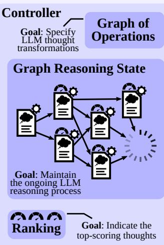
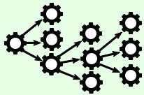

# Graph of Thoughts: Solving Elaborate Problems with Large Language Models

# Maciej Besta $^{1*}$ , Nils Blach $^{1*}$ , Ales Kubicek $^{1}$ , Robert Gerstenberger $^{1}$ , Lukas Gianinazzi $^{1}$ , Joanna Gajda $^{2}$ , Tomasz Lehmann $^{2}$ , Michał Podstawski $^{3}$ , Hubert Niewiadomski $^{2}$ , Piotr Nczyk $^{2}$ , Torsten Hoefler $^{1}$

1ETH Zurich, 2Cledar, 3Warsaw University of Technology bestam@inf.ethz.ch, nils.blach@inf.ethz.ch, htor@inf.ethz.ch

# Abstract

We introduce Graph of Thoughts (GoT): a framework that advances prompting capabilities in large language models (LLMs) beyond those offered by paradigms such as Chain-of-Thought or Tree of Thoughts (ToT). The key idea and primary advantage of GoT is the ability to model the information generated by an LLM as an arbitrary graph, where units of information ("LLM thoughts") are vertices, and edges correspond to dependencies between these vertices. This approach enables combining arbitrary LLM thoughts into synergistic outcomes, distilling the essence of whole networks of thoughts, or enhancing thoughts using feedback loops. We illustrate that GoT offers advantages over state of the art on different tasks, for example increasing the quality of sorting by  $62\%$  over ToT, while simultaneously reducing costs by  $>31\%$ . We ensure that GoT is extensible with new thought transformations and thus can be used to spearhead new prompting schemes. This work brings the LLM reasoning closer to human thinking or brain mechanisms such as recurrence, both of which form complex networks.

Website & code: https://github.com/spcl/graph-of-thoughts

# 1 Introduction

Large language models (LLMs) are taking over the world of AI. Recent years saw a rapid development of models primarily based on the decoder-only Transformer variant [64], such as GPT [52, 51, 14, 13], PaLM [19], or LLaMA [62].

Prompt engineering is a resource-efficient approach for solving different LLM tasks. In brief, one includes the task description within the input sent to an LLM. If this description is appropriately formulated, the LLM solves the task using its autoregressive token-based mechanism for generating text. Such prompts may contain example tasks with solutions (few-shot prompting, also referred to as in-context learning (ICL)), or even no example tasks at all (zero-shot prompting). Recent years shown that this mechanism can be used to solve a broad set of tasks that involve mathematical, commonsense, or symbolic reasoning.

Chain-of-Thought (CoT) [70] is an approach for prompting, in which one includes the intermediate steps of reasoning within the prompt (intermediate "thoughts"), besides the task input/output. CoT was shown to significantly improve the capability of LLMs to solve problems without resorting to any model updates. One major improvement over

CoT, Self-Consistency with CoT (CoT-SC) [66], is a scheme where multiple CoTs are generated, and then the best one is selected as the outcome. More recently, CoT and CoT-SC were extended with Tree of Thoughts (ToT) [43, 76, 74], which models the LLM reasoning process with a tree. This facilitates using different paths of thoughts, and offers novel capabilities such as backtracking from non-promising outcomes. Unfortunately, the ToT approaches still fundamentally limit the reasoning abilities within a prompt by imposing the rigid tree structure on the thought process.

In this work, we argue that fundamentally more powerful prompting can be achieved by enabling LLM thoughts to form an arbitrary graph structure. This is motivated by numerous phenomena such as human reasoning, brain structure, or algorithmic execution. When working on a novel idea, a human would not only follow a chain of thoughts (as in CoT) or try different separate ones (as in ToT), but would actually form a more complex network of thoughts. For example, one could explore a certain chain of reasoning, backtrack and start a new one, then realize that a certain idea from the previous chain could be combined with the currently explored one, and merge them both into a new solution, taking advantage of their strengths and eliminating their weaknesses. Similarly, brains form complex networks, with graph-like patterns such as recurrence [28]. Executing algorithms also expose networked patterns, often represented by Directed Acyclic Graphs. The corresponding graph-enabled transformations bring a promise of more powerful prompting when applied to LLM thoughts, but they are not naturally expressible with CoT or ToT.

We observe that these (and many other) thought transformations can be naturally enabled when modeling a reasoning process of an LLM as a graph. For this, we propose Graph of Thoughts (GoT), an approach that enhances LLMs' capabilities through networked reasoning (contribution #1). In GoT, an LLM thought is modeled as a vertex, while an edge is a dependency between such thoughts. Using GoT, one can aggregate arbitrary thoughts by constructing vertices that have more than one incoming edge. Overall, the graph abstraction harnessed by GoT seamlessly generalizes CoT and ToT to more complex thought patterns, without resorting to any model updates.

Yet, putting GoT to practice requires solving several design challenges. For example, what is the best graph structure for different tasks? How to best aggregate thoughts to maximize accuracy and minimize cost? To answer these and

many other questions, we carefully design a modular architecture for implementing GoT (contribution #2), coming with two design highlights. First, we enable a fine-grained control over individual thoughts. This enables us to fully control the ongoing conversation with the LLM, and apply advanced thought transformations, such as combining most promising thoughts from the ongoing reasoning into a new one. Second, we ensure that our architecture can be seamlessly extended with novel thought transformations, patterns of reasoning (i.e., graphs of thoughts), and LLM models. This enables rapid prototyping of novel prompting ideas using GoT, while experimenting with different models such as GPT-3.5, GPT-4, or Llama-2 [63].

We illustrate several use cases for GoT (sorting, keyword counting for summaries, set operations, document merging) and we detail how to implement them using the graph-based paradigm (contribution #3). We evaluate GoT and show its advantages over the state of the art (contribution #4). Overall, we observe that GoT is particularly well-suited for tasks that can be naturally decomposed into smaller subtasks that are solved individually and then merged for a final solution. Here, GoT outperforms other schemes, for example improving upon CoT and ToT by, respectively,  $\approx 70\%$  and  $\approx 62\%$ , in terms of the quality of sorting, while simultaneously reducing costs by  $>31\%$  over ToT.

We qualitatively compare GoT to other prompting schemes in Table 1. GoT is the only one to enable arbitrary graph-based thought transformations within a prompt, such as aggregation, embracing all previously proposed schemes.

<table><tr><td>Scheme</td><td>Sc?</td><td>Mc?</td><td>Tr?</td><td>Ag?</td></tr><tr><td>Chain-of-Thought (CoT) [70]</td><td>■</td><td>×</td><td>×</td><td>×</td></tr><tr><td>Self-Consistency with CoT [66]</td><td>■</td><td>■</td><td>×</td><td>×</td></tr><tr><td>Thought decomposition [74]</td><td>■</td><td>■</td><td>■</td><td>×</td></tr><tr><td>Tree-of-Thought (ToT) [43]</td><td>■</td><td>■</td><td>■</td><td>×</td></tr><tr><td>Tree of Thoughts (ToT) [76]</td><td>■</td><td>■</td><td>■</td><td>×</td></tr><tr><td>Graph of Thoughts (GoT)</td><td>■</td><td>■</td><td>■</td><td>■</td></tr></table>

Table 1: Comparison of prompting schemes, with respect to the supported transformations of thoughts. "Sc?": single chain of thoughts? "Mc?": multiple chains of thoughts? "Tr?": tree of thoughts? "Ag?": arbitrary graph of thoughts? "": full support, "": partial support, "": no support. Note that we do not include a recent scheme called Graph-of-Thought [78] because it is not a prompting scheme. While its name suggests close connections to ToT and CoT, as a fine-tuning scheme, it resorts to model updates, and is thus outside the focus of this work.

Finally, we propose a new metric for evaluating a prompting strategy, the volume of a thought (contribution #5). With this metric, we aim to understand better the differences between prompting schemes. For a given thought  $v$ , the volume of  $v$  is the number of LLM thoughts, from which one can reach  $v$  using directed edges. Intuitively, these are all the LLM thoughts that have had the potential to contribute to  $v$ . We show that GoT, by incorporating thought transformations such as aggregation, enables thoughts to have fundamentally larger volumes than other schemes.

# 2 Background & Notation

We first outline background concepts and notation.

# 2.1 Language Models & In-Context Learning

The conversation with the LLM consists of user messages (prompts) and LLM replies (thoughts). We follow the established notation [76] and we denote a pre-trained language model (LM) with parameters  $\theta$  as  $p_{\theta}$ . Lowercase letters such as  $x, y, z, \ldots$  indicate LLM thoughts. We purposefully do not prescribe what is a single "thought", and instead make it use-case specific. Hence, a single thought can be a paragraph (e.g., in article summary), a document (e.g., in document generation), a block of code (e.g., in code debugging or optimization), and so on.

We next describe specific prompting approaches.

Input-Output (IO) The Input-Output (IO) prompting is a straightforward approach, in which we use an LLM to turn an input sequence  $x$  into the output  $y$  directly, without any intermediate thoughts.

Chain-of-Thought (CoT) Second, in Chain-of-Thought (CoT), one introduces intermediate thoughts  $a_1, a_2, \ldots$  between  $x$  and  $y$ . This strategy was shown to significantly enhance various LM tasks over the plain IO baseline, such as mathematical puzzles [70] or general mathematical reasoning [24].

Multiple CoTs Third, one can generalize CoT into multiple CoTs by generating several (independent)  $k$  CoTs, and returning the one with the best output (according to some prescribed scoring metric). It was introduced by Wang et al. in the scheme called Self-Consistency with CoT (CoTSC) [66]. This approach enhances CoT because it offers an opportunity to explore different reasoning paths. However, it does not offer "local exploration" within a path, such as backtracking.

Tree of Thoughts (ToT) Finally, the Tree of Thoughtd (ToT) scheme was introduced independently by Yao [76] and Long [43] (where it is referred to as Tree-of-Thought); it was used implicitly to a certain degree by other schemes such as thought decomposition [74]. It enhances CoT-SC by modeling the process or reasoning as a tree of thoughts. A single tree node represents a partial solution. Based on a given node, the thought generator constructs a given number  $k$  of new nodes. Then, the state evaluator generates scores for each such new node. Depending on the use case, the evaluation could be conducted using an LLM itself, or it can harness human scores. Finally, the schedule of extending the tree is dictated by the utilized search algorithm (for example BFS or DFS).

# 3 The GoT Framework

We now detail the GoT framework. We present it in Figure 1, and compare it to other prompting strategies.

Formally, GoT can be modeled as a tuple  $(G, \mathcal{T}, \mathcal{E}, \mathcal{R})$ , where  $G$  is the "LLM reasoning process" (i.e., all the LLM thoughts within the context, with their relationships),  $\mathcal{T}$  are

  
Figure 1: Comparison of Graph of Thoughts (GoT) to other prompting strategies.

the potential thought transformations,  $\mathcal{E}$  is an evaluator function used to obtain scores of thoughts, and  $\mathcal{R}$  is a ranking function used to select most relevant thoughts.

# 3.1 Reasoning Process

We model the reasoning process as a directed graph  $G = (V, E)$ ;  $V$  is a set of vertices and  $E \subseteq V \times V$  is a set of edges.  $G$  is directed and thus the edges are a subset of ordered vertex pairs  $E \subseteq V \times V$ . A vertex contains a solution to a problem at-hand (be it an initial, intermediate, or a final one). The concrete form of such a thought depends on a use case; it could be a paragraph (in writing tasks) or a sequence of numbers (in sorting). A directed edge  $(t_1, t_2)$  indicates that thought  $t_2$  has been constructed using  $t_1$  as "direct input", i.e., by explicitly instructing the LLM to use  $t_1$  for generating  $t_2$ .

In certain use cases, graph nodes belong to different classes. For example, in writing tasks, some vertices model plans of writing a paragraph, while other vertices model the actual paragraphs of text. In such cases, GoT embraces a heterogeneous graph  $G = (V, E, c)$  to model the LLM reasoning, where  $c$  maps vertices  $V$  into their respective classes  $C$  (in the above case, it would be  $C = \{ \text{plan, par} \}$ ). Hence, any vertex  $v$  can model different aspects of reasoning.

We associate  $G$  with the LLM reasoning process. To advance this process, one applies thought transformations to  $G$ . An example such transformation is to merge best-scoring (so far) thoughts into a new one. Another example is to loop over a thought, in order to enhance it. Note that these transformations strictly extend the set of transformations available in the CoT, CoT-SC, or ToT.

# 3.2 Transformations of Thoughts

GoT enables novel transformations of thoughts thanks to the graph-based model for reasoning. We refer to them as graph-enabled transformations. For example, in writing, one could combine several input articles into one coherent summary. In sorting, one could merge several sorted subar

  
Figure 2: Examples of aggregation and generation thought transformations.

rays of numbers into a final sorted array. We illustrate examples of aggregation and generation in Figure 2.

Formally, each such transformation can be modeled as  $\mathcal{T}(G,p_{\theta})$  where  $G = (V,E)$  is the graph reflecting the current state of the reasoning, and  $p_{\theta}$  is the used LLM.  $\mathcal{T}$  modifies  $G$  usually by adding new vertices and their incoming edges. We have  $G^{\prime} = \mathcal{T}(G,p_{\theta}) = (V^{\prime},E^{\prime})$ , where  $V^{\prime} = (V\cup V^{+})\setminus V^{-}$  and  $E^{\prime} = (E\cup E^{+})\setminus E^{-}$ .  $V^{+}$  and  $E^{+}$  are new vertices and edges inserted into  $G$  to model the new thoughts and their dependencies, respectively. To maximize the expressiveness of GoT - we also enable the user to explicitly remove thoughts, by specifying the corresponding vertices and edges to be removed  $(V^{-}$  and  $E^{-}$ , respectively). Here, it is the user's responsibility to ensure that the sets  $V^{+},E^{+},V^{-}$ , and  $E^{-}$  come with consistent transformations (i.e., for example, that the user does not attempt to remove a vertex that does not exist). This enables seamless incorporation of schemes where, in order to save space within the context, one can remove parts of reasoning that do not promise improvements.

The specific form of  $\mathcal{T}$  and how it impacts  $G$  depends on a specific transformation. We first detail the primary graph-enabled thought transformations, and then proceed to describe how GoT embraces the transformations from the earlier schemes. Unless stated otherwise,  $V^{-} = E^{-} = \emptyset$ .

Aggregation Transformations First, with GoT, one can aggregate arbitrary thoughts into new ones, to combine and reinforce the advantages of these thoughts, while eliminating their disadvantages. In the basic form, in which only one new vertex is created,  $V^{+} = \{v^{+}\}$  and  $E^{+} = \{(v_{1},v^{+}),\dots,(v_{k},v^{+})\}$ , where  $v_{1},\dots,v_{k}$  are the merged  $k$  thoughts. More generally, this enables aggregating reasoning paths, i.e., longer chains of thoughts, beyond just individual thoughts. With the graph model, is it simply achieved by adding outgoing edges from the vertices  $v_{1},\dots,v_{k}$  modeling final thoughts in several chains, into a single thought  $v^{+}$  combining these chains.

Refining Transformations Another thought transformation is the refining of a current thought  $v$  by modifying its content:  $V^{+} = \{\}$  and  $E^{+} = \{(v,v)\}$ . This loop in the graph indicates an iterated thought with the same connections as the original thought.

Generation Transformations Finally, one can generate one or more new thoughts based on an existing single thought  $v$ . This class embraces analogous reasoning steps from earlier schemes, such as ToT or CoT-SC. Formally, we have  $V^{+} = \{v_{1}^{+}, \dots, v_{k}^{+}\}$  and  $E^{+} = \{(v, v_{1}^{+}), \dots, (v, v_{k}^{+})\}$ .

# 3.3 Scoring & Ranking Thoughts

Thoughts are scored to understand whether the current solution is good enough. A score is modeled as a general function  $\mathcal{E}(v, G, p_{\theta})$ , where  $v$  is a thought to be evaluated. We use the state of the whole reasoning process  $(G)$  in  $\mathcal{E}$  for maximum generality, because - for example - in some evaluation scenarios, scores may be relative to other thoughts.

GoT can also rank thoughts. We model this with a function  $\mathcal{R}(G,p_{\theta},h)$  where  $h$  specifies the number of highest-ranking thoughts in  $G$  to be returned by  $\mathcal{R}$ . While the specific form of  $\mathcal{R}$  depends on a use case, we most often use a simple yet effective strategy where  $h$  thoughts with highest scores are returned, i.e.,  $v_{1},\ldots,v_{h} = \mathcal{R}(G,p_{\theta},h)$ .

Specific forms of  $\mathcal{E}$  and  $\mathcal{R}$  depend on a use case. We discuss the details in Section 5. For example, the score (or rank) for sorting corresponds to the count of elements correctly sorted (or incorrectly, when obtaining the error as a score).

# 4 System Architecture & Extensibility

The GoT architecture consists of a set of interacting modules, see Figure 3 (the blue part). These modules are the Prompt (prepares the messages for the LLM), the Parser (extracts information from LLMs' replies), the Scoring module (verifies and scores the LLM replies), and the Controller (coordinates the entire reasoning process, and decides on how to progress it). The Controller contains two further important elements: the Graph of Operations (GoO) and the Graph Reasoning State (GRS). GoO is a static structure that

specifies the graph decomposition of a given task, i.e., it prescribes transformations to be applied to LLM thoughts, together with their order & dependencies. GRS is a dynamic structure that maintains the state of the ongoing LLM reasoning process (the history of its thoughts and their states).

# 4.1 Prompt

The Prompt prepares the prompt to be sent to the LLM. This module is responsible for the specifics of encoding the graph structure within the prompt. The GoT architecture enables the user to implement use-case specific graph encodings by providing full access to the graph structure.

# 4.2 Parser

The Parser extracts information from LLM's thoughts. For each such thought, the Parser constructs the thought state, which contains this extracted information. The thought state is then used to update GRS accordingly.

# 4.3 Scoring & Validation

Here, we verify whether a given LLM's thought satisfies potential correctness conditions, and then we assign it a score. Depending on how the score is derived, the module may consult the LLM. Moreover, depending on the use case, the score may also be assigned by a human. Finally, use cases such as sorting use simple local scoring functions.

# 4.4 Controller

The Controller implements a specific strategy for selecting thoughts from its GRS structure. It also selects what transformations should be applied to which thoughts, and then passes this information to the Prompter. It also decides whether the whole process should be finalized, or whether the next round of interaction with the LLM should be initiated. In our current design, this is dictated by the execution plan specified in GoO.

# 4.5 GoO & GRS

The user constructs a GoO instance, which prescribes the execution plan of thought operations. GoO is a static structure that is constructed once, before the execution starts. Each operation object knows its predecessor operations and successor operations. Then, during the execution, an instance of GoO maintains the continually updated information about the LLM reasoning process. This includes which operation has been executed so far, the states of all the generated LLM thoughts, their validity and scores, and any other relevant information.

The above elements offer extensible APIs, enabling straightforward implementations of different prompting schemes. The APIs are outlines in the green part of Figure 3, and detailed in the documentation. We also provide examples of prompts used by these operations and a corresponding GRS in the red part of Figure 3.

# 5 Example Use Cases

We now describe several use cases of GoT.

# Legend

# Gray block

External entity

Module of the GoT system

Prompt

Thought:

Score

Thought state

Thought state  $^+$  its associated operations

Thought state thought's score

# API for Controller

- //LLM params: model used, temperature, max tokens, api key, org, ...
- //LLM cost features: prompt token cost, response token cost, ...
- //Instances of Prompter + Parser + Graph of Operations,
- //Any additional input parameters (e.g., numbers to be sorted).

# Available operations when building GoO (extensible)

- Generate, Aggregate, Score, ... //see Prompt API
- KeepBest(N) //preserves  $N$  best scoring thoughts
- Repeat(k) //Repeat a given operation  $k$  times, generating  $k$  thoughts.
//For example, this enables "Aggregate" to generate multiple outcomes //of the combination operation. Each such thought is maintained //within the Graph Reasoning State and scored individually.

# API for Prompter (extensible)

- Generate(t, k) //generate a prompt for  $k$  new thoughts, using thought  $t$ 
- ValidateAndImprove(t) //generate a prompt to enhance thought  $t$ 
- Aggregate(t1, ..., tk) //generate a prompt to combine thoughts  $t1, \ldots$ 
- Score(t) //score thought  $t$ 
- Validate(t) //generate a prompt to validate the correctness of thought  $t$

# API for Parser (extensible)

ParseGenerate, ParseImprove, ParseScore, ParseAggregate, ParseValidate, ... //Each of the above routines is responsible for parsing an LLM's reply //to a corresponding Prompt routine (e.g., ParseScore parses Score).

# Architecture overview

# Specifying the Structure of Graph of Operations (GoO)

Graph of Operations enables seamless specification of not only GoT, but also existing schemes such as CoT, CoT-SC, ToT

# Example prompts and the Graph Reasoning State for the sorting use case

(some examples within each prompt are omitted due to space constraints)

# Initial/system prompt

(optional)

Hello. I want to sort the following input sequence of numbers: {input}

# A prompt used by Generate(t, k=1) + Repeat(k=4)

<Instruction> Sort the following list of numbers in ascending order. Output only the sorted list of numbers, no additional text. </Instruction>

<Example> Input: [3, 7, 0, 2, 8, 1, 2, 2, 2, 4, 7, 8, 5, 5, 3, 9, 4, 3, 5, 6, 4, 4, 5, 2, 0, 9, 3, 3, 9, 2, 1] Output: [0, 0, 1, 1, 2, 2, 2, 2, 2, 3, 3, 3, 3, 4, 4, 4, 4, 5, 5, 5, 5, 6, 6, 7, 7, 8, 8, 9, 9, 9] </Example> The input thought t   
Input: {input}   
This prompt is used by an operation Generate where the branching factor is  $\mathrm{k = 1}$  , which means, only one thought is generated. However, as we chain it with the operation Repeat with  $\mathrm{k} = 4$  , the underlying GoT framework ensures that Generate executes 4 times and results in 4 separate thoughts. Note that, from the graph theory perspective, the GRS is identical to that in the operation Generate(t, k=4) The difference between these two is that Generate(t, k=4) gives the user more freedom to choose the thought constructed, while Generate(t, k=1)  $^+$  Repeat  $(\mathrm{k} = 4)$  is less flexible but more easy to use. Moreover, with Repeat one has 4 context-isolated responses from the LLM for identical prompts, whereas without Repeat there is only one context where all 4 thoughts are generated and must be explicitly handled in a single prompt/session.

# A prompt used by

# Aggregate(t1,t2)  $^+$  Repeat  $(k = 3) +$  KeepBest  $(N = 1)$

<Instruction> Merge the following 2 sorted lists of length [length1] each into one sorted list of length [length2] using a merge sort style approach. Only output the final merged list without any additional text or thoughts! </Instruction>

<Approach> To merge the two lists in a merge-sort style approach, foloow these steps: 1. Compare the first element of both lists. 2. Append the smaller element to the merged list and move to the next element in the list from which the smaller element came. 3. Repeat steps 1 and 2 until one of the lists is empty. 4. Append the remaining elements of the non-empty list to the merged list. </Approach> Merge the following two lists into one sorted list: 1: {input1} 2: {input2} The input thoughts t1, t2 3: {input3} 4: {input4} Merged list: This prompt is used by an operation Aggregate where the aggregation factor is  $\mathrm{k} = 2$  (2 input thoughts, t1 and t2, are aggregated). This is repeated by GoT 3 time to maximize quality. Finally, the best result is selected. Note that, in this example, the prompt explicitly requests the merge operation only. All the remaining operations are specified in GoO and are handled by the underlying GoT framework.

# A prompt used by Improve(t) + Repeat (k=4)

<Instruction> The following two lists represent an unsorted list of numbers and a sorted variant of that list. The sorted variant is not correct. Fix the sorted variant so that it is correct. Make sure that the output list is sorted in ascending order, has the same number of elements as the input list ([length]), and contains the same elements as the input list. </Instruction>

<Approach>   
To fix the incorrectly sorted list follow these steps: 1. For each number from 0 to 9, compare the frequency of that number in the incorrectly sorted list to the frequency of that number in the input list. 2. Iterate through the incorrectly sorted list and add or remove numbers as needed to make the frequency of each number in the incorrectly sorted list match the frequency of that number in the input list.   
</Approach>   
<Examples>   
Input: [3, 7, 0, 2, 8, 1, 2, 2, 2, 4, 7, 8, 5, 5, 3, 9]

Incorrectly Sorted: [0, 0, 0, 0, 0, 1, 2, 2, 3, 3, 4, 4, 4, 5, 5, 7, 7, 8, 8, 9, 9, 9, 9] Reason: The incorrectly sorted list contains four extra 0s, two extra 4s and three extra 9s and is missing two 2s. Output: [0, 1, 2, 2, 2, 2, 3, 4, 3, 4, 5, 5, 7, 7, 8, 8, 9]

Input: [6,4,5,7,5,6,9,7,6,9,4,6,9,8,1,9,2,4,9,0,7,6,5,6,6,2,8,3,9,5,6,1]  
Incorrectly Sorted: [0,1,1,2,2,3,4,4,4,4,4,5,5,5,5,6,6,6,6,6,6,7,7,8,8,9,9,9,9,9,9,9]  
Reason: The incorrectly sorted list contains two extra 4s and is missing two 6s and one 9.  
Output: [0,1,1,2,2,3,4,4,5,5,5,6,6,6,6,6,6,6,7,7,7,8,8,9,9,9,9,9]  
</Examples>  
Input: {input}  
Incorrectly Sorted: {incorrectly Sorted}

This prompt is used by an operation. Improve(), which enhances a given though using information provided in another thought process. The operation is implemented by the user with GoT, it can either generate a number of new thoughts in GRS (the upper graph on the right), or it can generate a new thought in GRS (the lower graph on the right), chaining  $k = 4$  refinement iterative

<Instruction>Split the following list of 64 numbers into 4 lists of 16 numbers each, the first list should contain the first 16 numbers, the second list the second 16 numbers, the third list the third 16 numbers and the fourth list the fourth 16 numbers. Only output the final 4 lists in the following format without any additional text or thoughts!  
{  
    "List 1": [3, 4, 3, 5, 7, 8, 1, ...,]  
    "List 2": [2, 9, 2, 4, 7, 1, 5, ...,]  
    "List 3": [6, 9, 8, 1, 9, 2, 4, ...,]  
    "List 4": [9, 0, 7, 6, 5, 6, 6, ...]  
}></Instruction>

<Example>   
Input: [3,1,9,3,7,5,5,4,8,1,5,3,3,2,3,0,9,7,2,2,4,4,8,5,0, 8,7,3,8,7,0,9,5,1,6,7,6,8,9,0,3,0,6,3,4,8,0,6,9,8,4,1, 2,9,0,4,8,8,9,8,9,8,5,9]   
Output:   
{ "List 1":[3,1,9,3,7,5,5,4,8,1,5,3,3,2,3,0], "List 2":[9,7,2,2,4,4,8,5,0,8,7,3,3,8,7,0], "List 3":[9,5,1,6,7,6,8,9,0,3,0,6,3,4,8,0], "List 4":[6,9,8,4,1,2,9,0,4,8,8,9,9,8,5,9]   
}   
</Example> The input thought t   
Input: {input}   
This prompt is used by an operation Generate where the branching factor  $\mathrm{k} = 4$  . Four new thoughts are constructed based on the LLM reply to this prompt.

  
Figure 3: The system architecture of GoT, and the APIs of respective modules. The user can straightforwardly extend the design towards new prompting schemes, experiment with novel thought transformations, and plug in different LLMs. The blue part of the figure contains the architecture overview, the green part lists the API, and the red part contains example prompts together with a GRS and operations involved.

# 5.1 Sorting

Due to space constraints, we detail one use case (sorting). We focus on its decomposition and Graph of Operations, which are central for implementing and executing any workload within GoT. We consider sorting numbers 0-9 with duplicates. The considered LLMs are unable to sort a sequence of such numbers correctly beyond a certain length consistently because duplicate counts do not match.

In GoT, we employ merge-based sorting: First, one decomposes the input sequence of numbers into subarrays. Then, one sorts these subarrays individually, and then respectively merges them into a final solution. Figure 4 illustrates this use case together with its graph decomposition. Here, an LLM thought is a sequence of sorted numbers.

To score an outcome, denote an input sequence with  $[a_1, a_2, \dots, a_n]$  and an output one with  $[b_1, b_2, \dots, b_m]$ . We use the following score that determines "the scope" of errors:

$$
\text {e r r o r - s c o p e} = X + Y
$$

where  $p\in \{1,\dots,m\}$ $q\in \{1,\dots,n\}$  , and

$$
X = \sum_ {i = 1} ^ {m - 1} \operatorname {s g n} \left(\max  \left(b _ {i} - b _ {i + 1}, 0\right)\right),
$$

$$
Y = \sum_ {i = 0} ^ {9} | \left| \{b _ {p}: b _ {p} = i \} \right| - \left| \{a _ {q}: a _ {q} = i \} \right| |
$$

Here,  $X$  indicates how many consecutive pairs of numbers are incorrectly sorted. If two numbers  $i$  and  $i + 1$  are incorrectly sorted (i.e.,  $b_{i} > b_{i + 1}$ ), then the expression within the summation returns 1, increasing the error score by one. For two numbers correctly sorted, this expression amounts to 0. Then,  $Y$  determines how well a given output sequence preserves the frequency of output numbers. Specifically, for each considered number  $x$  ( $x \in \{0, \dots, 9\}$ ), we obtain the difference between the count of input elements being equal to  $x$ , vs. the count of output elements equal to  $x$ . For an output sequence perfectly preserving the frequency of  $x$ , this would amount to 0. Any single "deviation" in this count, increases the "error scope" by 1). We then sum this over all considered values of  $x$ . When plotting this score, to improve the clarity of plots, we additionally apply clipping min(error-scope,  $n$ ), as some baselines (IO, CoT) result in large numbers of outliers with high error scope. Finally, to use a "positive score" describing "the scope of correctly sorted" elements, one can use the value  $\max(n - \text{error-scope}, 0)$ .

# 5.2 Set Operations

Moreover, we also consider set operations, focusing on set intersection. They have numerous applications (particularly set intersection) in problems ranging from genome or document comparisons to pattern matching [20, 57, 38, 1, 27, 49, 10, 9]. Set intersection of two sets is implemented similarly as the sorting. The second input set is split into subsets and the intersection of those subsets with the first input set is determined with the help of the LLM. Afterwards the resulting

  
Details of the highlighted part of GoO from above  
Figure 4: An example graph decomposition of the sorting use case in GoT. All the used operations (Generate, Aggregate, Score, KeepBest) are described in Figure 3.

intersection sets are aggregated for the final results. For the evaluation we use different set sizes of 32, 64 and 128 elements and we vary the number of elements found in both sets to be between  $25\%$  and  $75\%$ .

Our score indicates the total number of missing or incorrectly included elements in the final intersection. Specifically, denote two input sets with  $A = [a_{1}, a_{2}, \ldots, a_{n}]$  and  $B = [b_{1}, b_{2}, \ldots, b_{n}]$ , and the output set with  $C = [c_{1}, c_{2}, \ldots, c_{m}]$ . Then,

$$
\text {e r r o r - s c o p e} = X _ {1} + X _ {2} + X _ {d}
$$

where  $X_{1} = |C \setminus (A \cap B)|$  are the number of elements in  $C$  that are not supposed to be there,  $X_{2} = |(A \cap B) \setminus C|$  are the number of elements missing from  $C$ , and  $X_{d}$  is the number of duplicates in  $C$  (because the LLM expresses the set as a list in natural language). Finally, to use a "positive score" describing "the scope of correctly computed" elements, one can use the value  $\max(n - \text{error-scope}, 0)$ .

# 5.3 Keyword Counting

Keyword counting finds the frequency of keywords in a given category (countries in our example implementation) within the input text. GoT splits the input text into multiple passages, counts the keywords in each passage and aggregates the sub-results. The number of passages is configurable and can also be left to the LLM, making it possible to treat each sentence as a separate passage. Here, to score a thought, we first – for each keyword – derive the absolute difference between the computed count and the correct one. We then sum all these differences to get the final score.

# 5.4 Document Merging

Finally, we also provide document merging. Here, the goal is to generate a new Non-Disclosure Agreement (NDA) document based on several input ones that partially overlap in terms of their contents. The goal is to ensure minimal amount of duplication, while maximizing information retention. Document merging is broadly applicable in, e.g., legal procedures, where multiple sources of information have to be combined into a single document or article. To score a solution, we query the LLM for two values (3 times for each value, and take the average). The first value corresponds to the solution redundancy (10 indicates no redundancy, 0 implies at least half the information is redundant), the second value stands for information retention (10 indicates all information is retained, 0 says that none is retained). We compute the harmonic mean of these values.

# 6 The Latency-Volume Tradeoff

We now show that GoT improves upon previous prompting schemes in terms of the tradeoff between latency (number of hops in the graph of thoughts to reach a given final thought) and volume. We define volume - for a given thought  $t$  - as the number of preceding LLM thoughts that could have impacted  $t$ . Formally, the volume of  $t$  is the number of thoughts from which there exists a path to  $t$  in the graph of thoughts. We assume that outputting a single thought costs  $O(1)$  time and fix the total cost to  $\Theta(n)$  for each prompting scheme.

The structure of the schemes is as follows. CoT-SC consists of  $k$  independent chains originating from a single starting thought. ToT is a complete  $k$ -ary tree. Finally, in GoT, a complete  $k$ -ary tree is joined at its leaves with a "mirrored"  $k$ -ary tree of the same size but with its edges reversed.

The analysis is detailed in Table 2. CoT offers a large volume of up to  $N$ , but at the cost of a high latency of  $N$ . CoTSC reduces the latency by a factor of  $k$  (which corresponds to its branching factor), but it simultaneously decreases the volume by  $k$  as well. ToT offers a latency of  $\log_k N$  but also has low volume. GoT is the only scheme to come with both a low latency of  $\log_k N$  and a high volume  $N$ . This is enabled by the fact that GoT harnesses aggregations of thoughts, making it possible to reach the final thought from any other intermediate thought in the graph decomposition.

Table 2: Comparison of prompting schemes, with respect to their fundamental tradeoff between latency and volume. GoT offers the best tradeoff.  

<table><tr><td>Scheme</td><td>Latency</td><td>Volume</td></tr><tr><td>Chain-of-Thought (CoT)</td><td>N</td><td>N</td></tr><tr><td>Self-Consistency with CoT (CoT-SC)</td><td>N/k</td><td>N/k</td></tr><tr><td>Tree of Thoughts (ToT)</td><td>logkN</td><td>O(logkN)</td></tr><tr><td>Graph of Thoughts (GoT)</td><td>logkN</td><td>N</td></tr></table>

# 7 Evaluation

We show the advantages of GoT over the state of the art. We focus on comparing GoT to ToT, as it was shown to consistently outperform other schemes. Still, for a broad comparison, we also experiment with IO, CoT, and CoT-SC. As our analysis results in a large evaluation space, we present representative results and omit data that does not bring relevant insights (e.g., CoT-SC).

# 7.1 Evaluation Methodology

We use 100 input samples for each task and comparison baseline. We set temperature to be 1.0 and we use 4k context unless stated otherwise. For each experiment, we fix the numbers of thoughts in respective schemes to achieve similar costs in each experiment.

Parameters We experiment extensively with the branching factor  $k$  and the number of levels  $L$  to ensure that we compare GoT to cost-effective and advantageous configurations. We plot two variants of ToT: one with higher  $k$  and lower depth (ToT), the other with lower  $k$  but higher  $L$  (ToT2). We usually aim to achieve a sweetspot in the tradeoff between sparser generation rounds (lower  $k$ ) vs. more rounds (larger  $L$ ). Usually more responses per round is more expensive (e.g., 80 vs. 60 total responses for Figure 7 but  $6 vs.$ 3 costs). We also try different problem sizes  $P$  (e.g., in sorting,  $P$  states how many numbers are to be sorted).

Used LLMs Due to budget restrictions, we focus on GPT-3.5, using GPT-4. We also experimented with Llama-2, but it was usually worse than GPT-3.5 and also much slower to run, making it infeasible to obtain enough samples.

  
Figure 5: Number of errors and cost in sorting tasks with ChatGPT-3.5.  $L$  and  $k$  indicate the structure of ToT (see Sections 3.2 and 6).

# 7.2 Analysis of GoT's Advantages

The results of analysis are in Figure 5 (sorting), 6 (set intersection), 7 (keyword counting), and 8 (document merging); see Section 5 for the description of specific use cases. Overall, GoT improves the quality of outcomes over all the considered baselines and it reduces inference costs compared to ToT.

GoT vs. ToT GoT improves upon ToT and ToT2 by a large margin over all the considered problem instances. ToT usually comes with somewhat higher quality than ToT2, but simultaneously much higher costs. GoT's costs are always lower than ToT, and comparable (in some cases lower, in others higher) than ToT2. For example, it reduces median error by  $\approx 62\%$ , thereby achieving a higher quality of sorting, for  $P = 128$  in comparison to ToT while ensuring  $>31\%$  cost reductions. These advantages are due to GoT's ability to decompose complex tasks into simpler sub-tasks, solve these sub-tasks independently, and then incrementally merge these outcomes into the final result.

GoT vs. IO and CoT GoT consistently delivers much higher quality of outcomes than IO/CoT. For example, for sorting  $(P = 64)$ , GoT's median error is  $\approx 65\%$  and  $\approx 83\%$  lower than, respectively, CoT and IO. Yet, the costs of GoT - and ToT - are much higher than in IO and CoT. This is mostly due to our configuration of CoT, where we do not artificially inflate the lengths of the chains of reasoning if this does not improve the outcomes. The higher costs of GoT and ToT are driven by  $k$  new thoughts built for each Generate operation; these multiple thoughts are one of the reasons for GoT's superiority in quality.

Increasing Complexity of Tackled Problems Most importantly, the advantages of GoT in the quality increase for all the baselines with the growing size of the problem  $P$ . For example, in sorting, while for  $P = 32$  GoT only negligibly improves upon ToT2, its median error count becomes lower by  $\approx 61\%$  for  $P = 64$  and  $\approx 69\%$  for  $P = 128$ . The quartiles also become respectively better. The results for other schemes also follow the intuition; for example, IO becomes

consistently worse with the increasing  $P$ , which is expected as a single thought is unlikely to solve a large problem instance. Overall, this analysis illustrates that GoT is indeed well-suited for elaborate problem cases, as the execution schedules usually become more complex with the growing problem sizes.

# 7.3 Discussion on Task Decomposition

When splitting a task into subtasks and then solving these subtasks, the size of responses and the input (in tokens) are reduced proportionally to the degree of task decomposition. However, the "static" part of the prompt (i.e., few-shot examples) may become a significant overhead (see GoT4 to GoT8 in Figure 7). Here, we observe that these few-shot examples can usually also be reduced in size (e.g., the passages used to demonstrate keyword counting can also be made smaller and still be indicative of the actual input size), thus actively working towards decreasing the cost (e.g., see the difference between GoT8 and GoTx in Figure 7).

The overall goal when conducting graph decomposition is to break down a task to the point, where the LLM can solve it correctly for the majority of time using a single prompt (or with a few additional improvement steps). This significantly lowers the number of improvement/refinement steps needed during the later stages of the graph exploration. Furthermore, as indicated by our results, combining or concatenating sub-results is usually an easier task than solving large task instances from scratch. Hence, the LLM is often successful when aggregating the final solution.

# 8 Related Work

We summarize relations between GoT and related work.

# 8.1 Prompting Paradigms & Approaches

We detail different prompting paradigms in Section 1 and Table 1. There are numerous other work related to prompting. We now briefly summarize selected most related ones;

  
Figure 6: Number of errors and cost in set intersection with ChatGPT-3.5.  $L$  and  $k$  indicate the structure of ToT (see Sections 3.2 and 6).

  
Figure 7: Number of errors and cost in keyword counting with ChatGPT-3.5.  $L$  and  $k$  indicate the structure of ToT (see Sections 3.2 and 6).

more extensive descriptions can be found in dedicated surveys [68, 40, 69, 34]. Wang et al. proposed Plan-and-Solve, an approach to enhance CoT with an explicit planning stage [65]. Using complexity-based criteria to enhance prompting within a CoT was designed by Fu et al. [66, 29]. The self-taught reasoner (STaR) [79] generates several chain of thoughts, and selects the ones that are valid. Similarly, a scheme by Shum et al. [60] generates a pool of CoT candidates, and selects the best candidate based on whether the candidates match the ground truth and on a policy gradient-based method. Automatic prompt generation overcomes the issues of scaling in CoT [58, 42, 41]. Zhou et al. proposes to harness selecting the best prompt out of a candidate set [83].

Finally, in prompt chaining, one cascades different LLMs. This enables prompting different LLMs via different con

  
Figure 8: Score and cost in document merging with ChatGPT-3.5.  $L$  and  $k$  indicate the structure of ToT (see Sections 3.2 and 6). Number of samples: 50; context size: 16k tokens.

texts, enabling more powerful reasoning [21, 47, 72, 23, 50, 71, 72]. GoT is orthogonal to this class of schemes, as it focuses on a single context capabilities.

# 8.2 Self-Reflection & Self-Evaluation

Self-reflection and self-evaluation were introduced recently [59, 48, 45, 74]. They are used to enhance different tasks, for example for code generation [17] or computer operation tasks [39]. In GoT, we partially rely on self-evaluation when taking decisions on how to expand the graph of thoughts within a prompt.

# 8.3 LLMs & Planning

There are many works recently on how to plan complex tasks with LLMs [36, 80, 77, 75, 67, 37]. GoT could be seen

as a generic framework that could potentially be used to enhance such schemes, by offering a paradigm for generating complex graph-based plans.

# 8.4 Graphs and Graph Computing

Graphs have become an immensely popular and important part of the general computing landscape [44, 46, 32, 31, 55]. Recently, there has been a growing interest in domains such as graph databases [53, 54, 11, 4, 5, 8], graph pattern matching [25, 18, 61, 10, 2, 1], graph streaming [26, 22, 3], and graph machine learning as well as graph neural networks [33, 73, 82, 81, 16, 33, 12, 6, 30, 56, 7]. The graph abstraction has been fruitful for many modern research domains, such as social sciences (e.g., studying human interactions), bioinformatics (e.g., analyzing protein structures), chemistry (e.g., designing chemical compounds), medicine (e.g., drug discovery), cybersecurity (e.g., identifying intruder machines), healthcare (e.g., exposing groups of people who submit fraudulent claims), web graph analysis (e.g., providing accurate search services), entertainment services (e.g., predicting movie popularity), linguistics (e.g., modeling relationships between words), transportation (e.g., finding efficient routes), physics (e.g., understanding phase transitions and critical phenomena), and many others [44, 20, 38, 35, 15]. In this work, we harness the graph abstraction as a key mechanism that enhances prompting capabilities in LLMs.

# 9 Conclusion

Prompt engineering is one of the central new domains of the large language model (LLM) research. It enables using LLMs efficiently, without any model updates. However, designing effective prompts is a challenging task.

In this work, we propose Graph of Thoughts (GoT), a new paradigm that enables the LLM to solve different tasks effectively without any model updates. The key idea is to model the LLM reasoning as an arbitrary graph, where thoughts are vertices and dependencies between thoughts are edges. This enables novel transformations of thoughts, such as aggregation. Human's task solving is often non-linear, and it involves combining intermediate solutions into final ones, or changing the flow of reasoning upon discovering new insights. GoT reflects this with its graph structure.

GoT outperforms other prompting schemes, for example ensuring  $62\%$  increase in the quality of sorting over ToT, while simultaneously reducing costs by  $>31\%$ . We also propose a novel metric for a prompting scheme, the volume of a thought, to indicate the scope of information that a given LLM output could carry with it, where GoT also excels. This provides a step towards more principled prompt engineering.

The graph abstraction has been the foundation of several successful designs in computing and AI over last decades, for example AlphaFold for protein predictions. Our work harnesses it within the realm of prompt engineering.

# Acknowledgements

We thank Hussein Harake, Colin McMurtrie, Mark Klein, Angelo Mangili, and the whole CSCS team granting access to the

Ault and Daint machines, and for their excellent technical support. We thank Timo Schneider for help with infrastructure at SPCL. This project received funding from the European Research Council (Project PSAP, No. 101002047), and the European High-Performance Computing Joint Undertaking (JU) under grant agreement No. 955513 (MAELSTROM). This project was supported by the ETH Future Computing Laboratory (EFCL), financed by a donation from Huawei Technologies. This project received funding from the European Union's HE research and innovation programme under the grant agreement No. 101070141 (Project GLACIATION).

# References

[1] M. Besta et al. Graphminesuite: Enabling high-performance and programmable graph mining algorithms with set algebra. arXiv preprint arXiv:2103.03653, 2021.  
[2] M. Besta et al. Sisa: Set-centric instruction set architecture for graph mining on processing-in-memory systems. arXiv preprint arXiv:2104.07582, 2021.  
[3] M. Besta et al. Practice of streaming processing of dynamic graphs: Concepts, models, and systems. IEEE TPDS, 2022.  
[4] M. Besta et al. High-performance graph databases that are portable, programmable, and scale to hundreds of thousands of cores. arXiv preprint arXiv:2305.11162, 2023.  
[5] M. Besta, R. Gerstenberger, N. Blach, M. Fischer, and T. Hoefler. Gdi: A graph database interface standard. Technical report, 2023. Available at https://spcl.inf.ethz.ch/Research/Parallel_Programming/GDI/.  
[6] M. Besta, R. Grob, C. Miglioli, N. Bernold, G. Kwasniewski, G. Gjini, R. Kanakagiri, S. Ashkboos, L. Gianinazzi, N. Dryden, et al. Motif prediction with graph neural networks. In ACM KDD, 2022.  
[7] M. Besta and T. Hoefler. Parallel and distributed graph neural networks: An in-depth concurrency analysis. arXiv preprint arXiv:2205.09702, 2022.  
[8] M. Besta, P. Iff, F. Scheidl, K. Osawa, N. Dryden, M. Podstawski, T. Chen, and T. Hoefler. Neural graph databases. In  $LOG$ , 2022.  
[9] M. Besta, R. Kanakagiri, H. Mustafa, M. Karasikov, G. Ratsch, T. Hoefer, and E. Solomonik. Communication-efficient jaccard similarity for high-performance distributed genome comparisons. arXiv preprint arXiv:1911.04200, 2019.  
[10] M. Besta, C. Miglioli, P. S. Labini, J. Tětek, P. Iff, R. Kanakagiri, S. Ashkboos, K. Janda, M. Podstawski, G. Kwasniewski, et al. Probgraph: High-performance and high-accuracy graph mining with probabilistic set representations. In ACM/IEEE Supercomputing, 2022.  
[11] M. Besta, E. Peter, R. Gerstenberger, M. Fischer, M. Podstawski, C. Barthels, G. Alonso, and T. Hoeffer. Demystifying graph databases: Analysis and taxonomy of data organization, system designs, and graph queries. arXiv preprint arXiv:1910.09017, 2019.

[12] M. M. Bronstein, J. Bruna, Y. LeCun, A. Szlam, and P. Vandergheynst. Geometric deep learning: going beyond euclidean data. IEEE Signal Processing Magazine, 34(4):18-42, 2017.  
[13] T. Brown, B. Mann, N. Ryder, M. Subbiah, J. D. Kaplan, P. Dhariwal, A. Neelakantan, P. Shyam, G. Sastry, A. Askell, et al. Language models are few-shot learners. Advances in neural information processing systems, 33:1877-1901, 2020.  
[14] S. Bubeck, V. Chandrasekaran, R. Eldan, J. Gehrke, E. Horvitz, E. Kamar, P. Lee, Y. T. Lee, Y. Li, S. Lundberg, et al. Sparks of artificial general intelligence: Early experiments with GPT-4. arXiv preprint arXiv:2303.12712, 2023.  
[15] D. Chakrabarti and C. Faloutsos. Graph mining: Laws, generators, and algorithms. ACM computing surveys (CSUR), 38(1):2, 2006.  
[16] I. Chami, S. Abu-El-Haija, B. Perozzi, C. Ré, and K. Murphy. Machine learning on graphs: A model and comprehensive taxonomy. arXiv preprint arXiv:2005.03675, 2020.  
[17] X. Chen, M. Lin, N. Scharli, and D. Zhou. Teaching large language models to self-debug. arXiv preprint arXiv:2304.05128, 2023.  
[18] J. Cheng, J. X. Yu, B. Ding, S. Y. Philip, and H. Wang. Fast graph pattern matching. In 2008 IEEE 24th International Conference on Data Engineering, pages 913-922. IEEE, 2008.  
[19] A. Chowdhery, S. Narang, J. Devlin, M. Bosma, G. Mishra, A. Roberts, P. Barham, H. W. Chung, C. Sutton, S. Gehrmann, et al. Palm: Scaling language modeling with pathways. arXiv preprint arXiv:2204.02311, 2022.  
[20] D. J. Cook and L. B. Holder. Mining graph data. John Wiley & Sons, 2006.  
[21] A. Creswell, M. Shanahan, and I. Higgins. Selection-inference: Exploiting large language models for interpretable logical reasoning. arXiv preprint arXiv:2205.09712, 2022.  
[22] L. Dhulipala et al. Low-latency graph streaming using compressed purely-functional trees. arXiv:1904.08380, 2019.  
[23] D. Dohan, W. Xu, A. Lewkowycz, J. Austin, D. Bieber, R. G. Lopes, Y. Wu, H. Michalewski, R. A. Saurous, J. Sohl-Dickstein, et al. Language model cascades. arXiv preprint arXiv:2207.10342, 2022.  
[24] I. Drori, S. Zhang, R. Shuttleworth, L. Tang, A. Lu, E. Ke, K. Liu, L. Chen, S. Tran, N. Cheng, et al. A neural network solves, explains, and generates university math problems by program synthesis and few-shot learning at human level. Proceedings of the National Academy of Sciences, 119(32):e2123433119, 2022.  
[25] W. Fan, J. Li, S. Ma, N. Tang, Y. Wu, and Y. Wu. Graph pattern matching: from intractable to polynomial time. Proceedings of the VLDB Endowment, 3(1-2):264-275, 2010.

[26] G. Feng et al. Distinguish: A distributed graph data structure for massive dynamic graph processing. In IEEE Big Data, pages 1814-1822, 2015.  
[27] A. Friggeri, G. Chelius, and E. Fleury. Triangles to capture social cohesion. In 2011 IEEE Third International Conference on Privacy, Security, Risk and Trust and 2011 IEEE Third International Conference on Social Computing, pages 258-265. IEEE, 2011.  
[28] K. Friston. Hierarchical models in the brain. PLoS computational biology, 4(11):e1000211, 2008.  
[29] Y. Fu, H. Peng, A. Sabharwal, P. Clark, and T. Khot. Complexity-based prompting for multi-step reasoning. arXiv preprint arXiv:2210.00720, 2022.  
[30] L. Gianinazzi, M. Fries, N. Dryden, T. Ben-Nun, and T. Hoefler. Learning combinatorial node labeling algorithms. arXiv preprint arXiv:2106.03594, 2021.  
[31] D. Gregor and A. Lumsdaine. Lifting sequential graph algorithms for distributed-memory parallel computation. ACM SIGPLAN Notices, 40(10):423-437, 2005.  
[32] D. Gregor and A. Lumsdaine. The parallel bg1: A generic library for distributed graph computations. POOSC, 2005.  
[33] W. L. Hamilton et al. Representation learning on graphs: Methods and applications. arXiv preprint arXiv:1709.05584, 2017.  
[34] M. Hartmann and D. Sonntag. A survey on improving nlp models with human explanations. arXiv preprint arXiv:2204.08892, 2022.  
[35] T. Horváth, T. Gartner, and S. Wrobel. Cyclic pattern kernels for predictive graph mining. In KDD, pages 158-167. ACM, 2004.  
[36] W. Huang, P. Abbeel, D. Pathak, and I. Mordatch. Language models as zero-shot planners: Extracting actionable knowledge for embodied agents. In International Conference on Machine Learning, pages 9118-9147. PMLR, 2022.  
[37] W. Huang, F. Xia, T. Xiao, H. Chan, J. Liang, P. Florence, A. Zeng, J. Tompson, I. Mordatch, Y. Chebotar, et al. Inner monologue: Embodied reasoning through planning with language models. arXiv preprint arXiv:2207.05608, 2022.  
[38] C. Jiang, F. Coenen, and M. Zito. A survey of frequent subgraph mining algorithms. The Knowledge Engineering Review, 28(1):75-105, 2013.  
[39] G. Kim, P. Baldi, and S. McAleer. Language models can solve computer tasks. arXiv preprint arXiv:2303.17491, 2023.  
[40] P. Lertvittayakumjorn and F. Toni. Explanation-based human debugging of nlp models: A survey. Transactions of the Association for Computational Linguistics, 9:1508-1528, 2021.  
[41] B. Lester, R. Al-Rfou, and N. Constant. The power of scale for parameter-efficient prompt tuning. arXiv preprint arXiv:2104.08691, 2021.

[42] X. L. Li and P. Liang. Prefix-tuning: Optimizing continuous prompts for generation. arXiv preprint arXiv:2101.00190, 2021.  
[43] J. Long. Large language model guided tree-of-thought. arXiv preprint arXiv:2305.08291, 2023.  
[44] A. Lumsdaine, D. Gregor, B. Hendrickson, and J. Berry. Challenges in parallel graph processing. Parallel Processing Letters, 17(01):5-20, 2007.  
[45] A. Madaan, N. Tandon, P. Gupta, S. Hallinan, L. Gao, S. Wiegreff, U. Alon, N. Dziri, S. Prabhumoye, Y. Yang, et al. Self-refine: Iterative refinement with self-feedback. arXiv preprint arXiv:2303.17651, 2023.  
[46] G. Malewicz, M. H. Austern, A. J. Bik, J. C. Dehnert, I. Horn, N. Leiser, and G. Czajkowski. Pregel: a system for large-scale graph processing. In ACM SIGMOD, pages 135-146. ACM, 2010.  
[47] M. Nye, A. J. Andreassen, G. Gur-Ari, H. Michalewski, J. Austin, D. Bieber, D. Dohan, A. Lewkowycz, M. Bosma, D. Luan, et al. Show your work: Scratchpads for intermediate computation with language models. arXiv preprint arXiv:2112.00114, 2021.  
[48] D. Paul, M. Ismayilzada, M. Peyrard, B. Borges, A. Bosselut, R. West, and B. Faltings. Refiner: Reasoning feedback on intermediate representations. arXiv preprint arXiv:2304.01904, 2023.  
[49] A. Prat-Pérez, D. Dominguez-Sal, J. M. Brunat, and J.-L. Larriba-Pey. Shaping communities out of triangles. In Proceedings of the 21st ACM international conference on Information and knowledge management, pages 1677-1681, 2012.  
[50] S. Qiao, Y. Ou, N. Zhang, X. Chen, Y. Yao, S. Deng, C. Tan, F. Huang, and H. Chen. Reasoning with language model prompting: A survey. arXiv preprint arXiv:2212.09597, 2022.  
[51] A. Radford, K. Narasimhan, T. Salimans, and I. Sutskever. Improving language understanding by generative pre-training, 2018.  
[52] A. Radford, J. Wu, R. Child, D. Luan, D. Amodei, I. Sutskever, et al. Language models are unsupervised multitask learners. OpenAI blog, 1(8):9, 2019.  
[53] I. Robinson, J. Webber, and E. Eifrem. Graph databases. "O'Reilly Media, Inc.", 2013.  
[54] I. Robinson, J. Webber, and E. Eifrem. Graph databases: new opportunities for connected data. O'Reilly Media, Inc.", 2015.  
[55] S. Sakr et al. The future is big graphs! a community view on graph processing systems. arXiv preprint arXiv:2012.06171, 2020.  
[56] F. Scarselli, M. Gori, A. C. Tsoi, M. Hagenbuchner, and G. Monfardini. The graph neural network model. IEEE transactions on neural networks, 20(1):61-80, 2008.  
[57] S. E. Schaeffer. Graph clustering. Computer science review, 1(1):27-64, 2007.

[58] T. Shin, Y. Razeghi, R. L. Logan IV, E. Wallace, and S. Singh. Autoprompt: Eliciting knowledge from language models with automatically generated prompts. arXiv preprint arXiv:2010.15980, 2020.  
[59] N. Shinn, B. Labash, and A. Gopinath. Reflection: an autonomous agent with dynamic memory and self-reflection. arXiv preprint arXiv:2303.11366, 2023.  
[60] K. Shum, S. Diao, and T. Zhang. Automatic prompt augmentation and selection with chain-of-thought from labeled data. arXiv preprint arXiv:2302.12822, 2023.  
[61] C. H. Teixeira, A. J. Fonseca, M. Serafini, G. Siganos, M. J. Zaki, and A. Aboulnaga. Arabesque: a system for distributed graph mining. In Proceedings of the 25th Symposium on Operating Systems Principles, pages 425-440. ACM, 2015.  
[62] H. Touvron, T. Lavril, G. Izacard, X. Martinet, M.-A. Lachaux, T. Lacroix, B. Rozière, N. Goyal, E. Hambro, F. Azhar, et al. Llama: Open and efficient foundation language models. arXiv preprint arXiv:2302.13971, 2023.  
[63] H. Touvron, L. Martin, K. Stone, P. Albert, A. Alma-hairi, Y. Babaei, N. Bashlykov, S. Batra, P. Bhargava, S. Bhosale, et al. Llama 2: Open foundation and finetuned chat models. arXiv preprint arXiv:2307.09288, 2023.  
[64] A. Vaswani, N. Shazeer, N. Parmar, J. Uszkoreit, L. Jones, A. N. Gomez, L. Kaiser, and I. Polosukhin. Attention is all you need. In NeurIPS, 2017.  
[65] L. Wang, W. Xu, Y. Lan, Z. Hu, Y. Lan, R. K.-W. Lee, and E.-P. Lim. Plan-and-solve prompting: Improving zero-shot chain-of-thought reasoning by large language models. arXiv preprint arXiv:2305.04091, 2023.  
[66] X. Wang, J. Wei, D. Schuurmans, Q. Le, E. Chi, and D. Zhou. Self-consistency improves chain of thought reasoning in language models. arXiv preprint arXiv:2203.11171, 2022.  
[67] Z. Wang, S. Cai, A. Liu, X. Ma, and Y. Liang. Describe, explain, plan and select: Interactive planning with large language models enables open-world multitask agents. arXiv preprint arXiv:2302.01560, 2023.  
[68] Z. Wang, G. Zhang, K. Yang, N. Shi, W. Zhou, S. Hao, G. Xiong, Y. Li, M. Y. Sim, X. Chen, et al. Interactive natural language processing. arXiv preprint arXiv:2305.13246, 2023.  
[69] Z. J. Wang, D. Choi, S. Xu, and D. Yang. Putting humans in the natural language processing loop: A survey. arXiv preprint arXiv:2103.04044, 2021.  
[70] J. Wei, X. Wang, D. Schuurmans, M. Bosma, E. Chi, Q. Le, and D. Zhou. Chain of thought prompting elicits reasoning in large language models. arXiv preprint arXiv:2201.11903, 2022.  
[71] T. Wu, E. Jiang, A. Donsbach, J. Gray, A. Molina, M. Terry, and C. J. Cai. Promptchainer: Chaining large language model prompts through visual programming.

In CHI Conference on Human Factors in Computing Systems Extended Abstracts, pages 1-10, 2022.  
[72] T. Wu, M. Terry, and C. J. Cai. AI chains: Transparent and controllable human-AI interaction by chaining large language model prompts. In Proceedings of the 2022 CHI Conference on Human Factors in Computing Systems, pages 1-22, 2022.  
[73] Z. Wu et al. A comprehensive survey on graph neural networks. IEEE Transactions on Neural Networks and Learning Systems, 2020.  
[74] Y. Xie, K. Kawaguchi, Y. Zhao, X. Zhao, M.-Y. Kan, J. He, and Q. Xie. Decomposition enhances reasoning via self-evaluation guided decoding. arXiv preprint arXiv:2305.00633, 2023.  
[75] S. Yang, O. Nachum, Y. Du, J. Wei, P. Abbeel, and D. Schuurmans. Foundation models for decision making: Problems, methods, and opportunities. arXiv preprint arXiv:2303.04129, 2023.  
[76] S. Yao, D. Yu, J. Zhao, I. Shafran, T. L. Griffiths, Y. Cao, and K. Narasimhan. Tree of thoughts: Deliberate problem solving with large language models. arXiv preprint arXiv:2305.10601, 2023.  
[77] S. Yao, J. Zhao, D. Yu, N. Du, I. Shafran, K. Narasimhan, and Y. Cao. React: Synergizing reasoning and acting in language models. arXiv preprint arXiv:2210.03629, 2022.  
[78] Y. Yao, Z. Li, and H. Zhao. Beyond chain-of-thought, effective graph-of-thought reasoning in large language models. arXiv preprint arXiv:2305.16582, 2023.  
[79] E. Zelikman, Y. Wu, J. Mu, and N. Goodman. Star: Bootstrapping reasoning with reasoning. Advances in Neural Information Processing Systems, 35:15476-15488, 2022.  
[80] S. Zhang, Z. Chen, Y. Shen, M. Ding, J. B. Tenenbaum, and C. Gan. Planning with large language models for code generation. arXiv preprint arXiv:2303.05510, 2023.  
[81] Z. Zhang, P. Cui, and W. Zhu. Deep learning on graphs: A survey. IEEE Transactions on Knowledge and Data Engineering, 2020.  
[82] J. Zhou et al. Graph neural networks: A review of methods and applications. AI Open, 1:57-81, 2020.  
[83] Y. Zhou, A. I. Muresanu, Z. Han, K. Paster, S. Pitis, H. Chan, and J. Ba. Large language models are human-level prompt engineers. arXiv preprint arXiv:2211.01910, 2022.

# A Positive Score Evaluation

The following figures plot the same data as Figures 5 and 6 respectively, however use the "positive score" described in Sections 5.1 and 5.2.

  
Figure 9: Accuracy and cost in sorting tasks with ChatGPT-3.5.  $L$  and  $k$  indicate the structure of ToT (see Sections 3.2 and 6).

  
Figure 10: Accuracy and cost in set intersection with ChatGPT-3.5.  $L$  and  $k$  indicate the structure of ToT (see Sections 3.2 and 6).